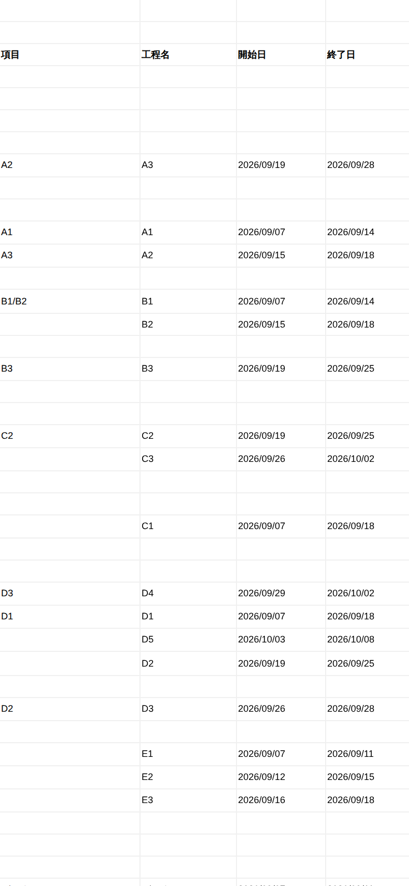
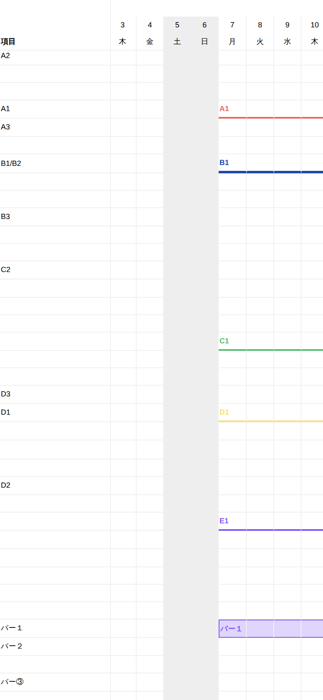
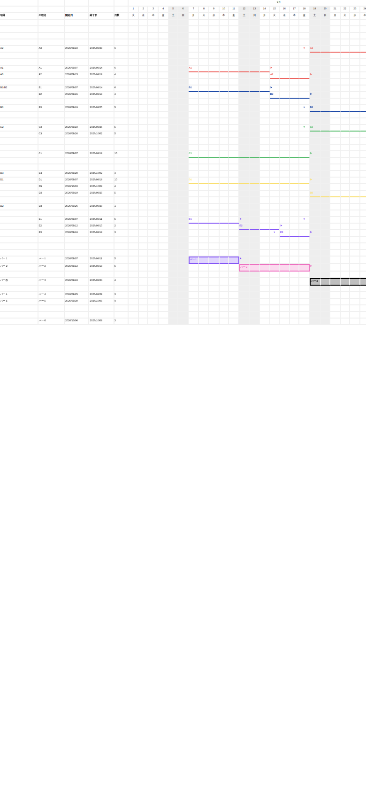

# 設計A 実装メモ ― プロジェクトG 工程表変換（xlsm 往路）

上位仕様は `spec/00_共通仕様_プロジェクトG工程表変換.md` と `spec/01_設計A_xlsm往路.md`。
本書はその 2 つに対して、**実装時に判断したこと・PDF との差異・未対応事項**を記録する。
VBA の全モジュールは 9 章に全文を載せてある（単体ファイルでの受け渡しはしない）。

---

## 0. 納品物

| ファイル | 中身 |
|---|---|
| `dist/プロジェクトG変換ツール.xlsm` | 監督 PC 用の変換ツール。VBA 8 モジュール入り |
| `dist/サポートルーム_サンプル工程表_20260901-20261010.xlsx` | サンプルで生成した業者用ファイル（マクロなし） |
| `dist/変換ログ.txt` | 上記を生成したときのログ。末尾が「合格」 |
| `設計A_実装メモ.md` | 本書。VBA 全文 + スマホ表示のスクリーンショット |
| `docs/スマホ表示_*.png` | 受け入れ試験 5 のスクリーンショット |
| `src/*.bas` | VBA ソース（xlsm に埋め込んだものと同一） |
| `build/`, `test/` | xlsm のビルドと、受け入れ試験の実行に使ったもの |

---

## 1. 入力の実測（共通仕様 3.4 との突き合わせ）

読み込み時にサンプルを実測し、共通仕様 3.4 の表と全項目一致することを確認した。

| 項目 | 仕様 3.4 | 実測 | 一致 |
|---|---|---|---|
| SHA-256 | `FAFDCD5F…8481B9` | `fafdcd5f…8481b9` | ○ |
| 工程数 | 23 | 23 | ○ |
| 見出し列数 | 124 | 124 | ○ |
| 形状分布 | yElbow 3 / gate 5 / straight 3 / boxM 1 / boxL 1 / barAutoAdjust 2 / barProcessNameAdjust 1 / crank 3 / boxS 1 / xElbow 3 | 同左 | ○ |
| 線幅 | 既定 20・2.5 が 2・1 が 1 | 同左 | ○ |
| 矢印 none | 2 件（C3, D5） | 2 件（C3, D5） | ○ |
| 斜行 true | 2 件（B2, C3） | 2 件（B2, C3） | ○ |
| 中間ノードあり | 5 件 | 5 件（全て gate/crank） | ○ |
| 行番号範囲 | 5〜46 | 5〜46 | ○ |

**この実測値はコードに埋めていない**（共通仕様 8章-1）。工程数・列数・行番号範囲はすべて
CSV から読んだ値で動く。停止条件としての `EXPECTED_ROWS` / `EXPECTED_HEADERS` は作っていない。
受け入れ試験 6（工程行を複製して 24 本）でそれを確認している。

PDF からは、日付列のピッチ（15.983pt）と行ピッチ（16.546pt）を実測して、
各工程の横線がどの行・どの日付範囲に描かれているかをベクタ座標で読み取り、
CSV の `開始日の行番号` / `開始日` / `終了日` と突き合わせた。
その結果、**線の始点 x = 開始日の列の左端、終点 x = 終了日 + 1 日の列の左端**
（共通仕様 4章の開始境界／終了境界）であることを確認している。

---

## 2. 仕様の解釈で判断したこと

迷ったところは Sample.zip の PDF / PNG を正とした。判断と根拠を残す。

### 2.1 同じ行に 2 工程が始まるケース（設計A 4.3）— サンプルで 5 件発生する

設計A 4.3 が「サンプルで発生するか確認して実装メモに書く」としていた件。**発生する。**

| プロジェクトG の行 | 1 本目 | 2 本目 | 2 本目の配置先 |
|---|---|---|---|
| 8 | A1 (09/07–09/14) | A2 (09/15–09/18) | 行 9 |
| 11 | B1 (09/07–09/14) | B2 (09/15–09/18) | 行 12 |
| 17 | C2 (09/19–09/25) | C3 (09/26–10/02) | 行 18 |
| 25 | D1 (09/07–09/18) | D2 (09/19–09/25) | 行 27 |
| 31 | E1 (09/07–09/11) | E2 (09/12–09/15) | 行 32 |

5 組とも「同じ行の上で日付が連続する数珠つなぎ」で、日付は重なっていない。
プロジェクトG 自身は形状ごとに横線を別の行へ逃がしている（yElbow は終了行、xElbow は開始行、
crank は開始行と終了行の中点、gate は中間ノード側）。しかし設計A 4.2 は
**全形状をバーとして開始日の行番号に描く**と決めているので、この衝突は設計の必然として起きる。

**判断**：設計A 4.3 の指示どおり、開始日の早い方が本来の行を保ち、残りを次の空行へ落とす。
後勝ちの上書きはしない。移した工程は変換ログに `警告 行衝突` として全件出す。
選び方は「開始行 → 開始日 → CSV 順」で決めているので、同じ CSV なら常に同じ結果になる。

- なぜ「同じ行に 2 本とも描く」にしなかったか：設計A 4.3 のデータ列（B 工程線名 / C 開始日 /
  D 終了日）は 1 行 1 工程でしか成立しない。同じ行に 2 本置くと 2 本目の日付を業者が直せず、
  復路の入口が片方しか作れない。「業者が日付を直せる」ことが本ツールの目的なので、
  見た目の一致より 1 行 1 工程を優先した。
- 6 章の「行」の検査は、移した工程については `_data` に記録した `割当行` と突き合わせている
  （4.1 参照）。移していない 18 件は `開始日の行番号 + 3` ちょうどである。

### 2.2 祝日 — 扱わない。プロジェクトG の画面とは見た目が変わる

プロジェクトG の PDF / 画面では 2026/09/21–09/23（敬老の日・振替・秋分の日）も灰色の休日列になっている。
また `休日` 列も祝日を数えている（例：A3 は 09/19–09/28 の 10 日間で `休日` = 7。
土日は 4 日しかないので、残り 3 日は祝日）。

**判断**：共通仕様 4章と指示に従い **v1 は土日だけ**を灰色にする。祝日はスコープ外。
したがって 9/21–9/23 の列は白いままで、ここだけ PDF と見た目が変わる。
あわせて、**`休日` 列は検算に使わない**（祝日を含むため、土日だけで計算した値と一致しない）。
`日数` 列は `=NETWORKDAYS(C,D)` で出しており、これも土日のみ除外する。

### 2.3 A 列の行見出し — CSV にノードが無い行は空にする

PDF の左端には、CSV のノードが無い行にも文字が出ている（行 19「C1/C3」、行 23「D5」、
行 32「D4」、行 47「バー6」）。これは プロジェクトG が持っている「工程の付いていない項目」や、
工程線名を項目欄に出す挙動によるもので、**CSV には出力されていない**（CSV は工程 = エッジの
一覧であり、孤立した項目は行に現れない）。

**判断**：共通仕様 4章の定義どおり「その行にノードを持つ項目名、複数あれば `/` 連結、空なら空」
で作る。CSV から作れない見出しは空のままにする。工程線名は B 列に必ず出るので情報は落ちない。

結果、A 列は PDF と次のとおり一致した（プロジェクトG の行 → 見出し）:
5 A2 / 8 A1 / 9 A3 / 11 B1/B2 / 14 B3 / 17 C2 / 24 D3 / 25 D1 / 29 D2 /
37 バー１ / 38 バー２ / 40 バー③ / 42 バー４ / 43 バー５。

なお `/` 連結は**サンプルでは 1 度も発動しない**。「B1/B2」は連結結果ではなく、
項目名そのものが `B1/B2` という文字列である。1 つの行に別々のノード ID が載るケースは
サンプルには無い。

### 2.4 工程線の色が空のときの既定色 — 黒

`バー３`（boxL）は `工程線の色` も `工程線の背景色` も空。PDF ではこのバーが黒い枠線で
描かれている。**判断**：色が空のときの既定線色を `#000000` とした。

### 2.5 barAutoAdjust の枠線 — 付けない（PDF とは変わる）

PDF の `バー５` は塗り `#5970f6` に対して赤（`#eb473d`）の枠線が付いている。
設計A 4.2 は barAutoAdjust を「塗り（背景色 or 線色）。枠なし」と明記している。
**判断**：設計 A に従い枠を描かない。PDF との差として記録する。

### 2.6 crank / gate の横線の行・縦線 — 描かない

PDF では crank の横線は開始行と終了行の中点（C1 は 21→19→17 の 19、C3 は 17→22 の中点 19.5）、
gate は中間ノード側の行に出る。共通仕様 6章が「折れ線・斜行・crank/gate の縦線」を
意図的に落とすと決めているので、**横線の行も含めて再現しない**。すべて開始日の行番号に
1 本のバーとして描く。これは欠陥ではなく設計上の決定。

終了行が開始行と違う工程には、終了行側の終了日の列に `▼`（線色）を置いて行き先だけ示す
（設計A 4.2）。サンプルでは A2・A3・B2・B3・C1・C3・D2・D3・D4・D5・E2・E3 の 12 件に付く。

### 2.7 バーの描き方 — 条件付き書式を選んだ（設計A 4.4）

設計A 4.4 は「静的塗り」か「条件付き書式」のどちらかを選び、理由を書けとしている。
**条件付き書式を選んだ。**

- 理由 1：復路の前提である「業者が C/D を直したらバーが動く」がそのまま手に入る。
- 理由 2：静的塗りと併用すると、業者が期間を縮めたときに古い塗りがゴーストとして残る。
  条件付き書式だけにすればゴーストが原理的に出ない。
- ルール数：線形状は 1 行 1 本、box 系は 3 本（左枠 / 右枠 / 塗り+上下枠）。サンプルで 29 本。
  設計A 4.4 のとおり 23 件規模では問題ない。1000 件級では未計測。
- 式は `=AND(F$2<>"",F$2>=$C{行},F$2<=$D{行})`。行 2 に**実日付**を入れて表示形式 `d` で
  日付を見せているので、この式が成立する。行 3 は同じ日付を表示形式 `aaa` で曜日として見せている。
- 土日をまたぐバー：線形状は下罫線だけを引くので土日の灰色はそのまま残る（共通仕様 4.2 の
  「土日列は背景灰のまま、罫線/塗りは連続させる」）。box / bar 系は塗りなので土日の灰色を覆う。
  プロジェクトG も同じ見え方になる。
- 6 章の「位置」の検査は `Range.DisplayFormat`（条件付き書式を適用したあとの、Excel が実際に
  表示している書式）をセルごとに読んで判定している。ルール文字列を読んで判断しているのではない。

### 2.8 出力の細部

| 項目 | 判断 | 根拠 |
|---|---|---|
| 出力ファイル名 | `<CSV名>_yyyymmdd-yyyymmdd.xlsx` | 設計A 1章の `<Start>-<End>` を日付 8 桁で実装。既存なら `_2`, `_3` と連番 |
| 出力シート名 | `工程表` | 業者が開くシート。`T10_Layout` は xlsm 内の生成元の名前 |
| 工程ID の置き場所 | 日付列の右隣 1 列。ロックして列非表示 | 設計A 4.5 |
| `_data` の列 | 元 CSV の 124 列をそのまま + `配置状態` `割当行` `シート行` `行衝突で移動` の 4 列 | 設計A 4.5。復路が配置結果を辿れるように |
| `_data` の値 | すべて文字列として書く | 元 CSV の表記を壊さないため（共通仕様 8章-6 の精神） |
| ウィンドウ枠の固定 | 行 1〜3 と A 列 | 設計A 4.1。C/D は固定していないので、横スクロールすると日付欄は画面外に出る |
| パス区切り | 元のパスに合わせる | Windows では `\`。テストを Linux で回すためでもある |
| 工程ID の重複 | 警告をログに出して描画は続ける | 復路の突き合わせキーなので重複は知らせる必要がある。受け入れ試験 6 で発動する |

---

## 3. PDF / プロジェクトG の画面との差異一覧

「意図的に落としたもの」と「環境の制約」を分けて書く。

### 3.1 設計上わざと落としたもの（共通仕様 6章）

| # | PDF / 画面 | 出力 xlsx | 根拠 |
|---|---|---|---|
| 1 | 折れ線・斜行・crank/gate の縦線 | 開始行に 1 本のバー | 共通仕様 6章 |
| 2 | 両端の白丸ノード | 描かない | 共通仕様 6章 |
| 3 | 依存関係・関係線（「関係１」の縦点線） | 描かない | 共通仕様 6章 |
| 4 | 工程線名の位置・サイズ指定（textSize XS〜XL） | バー先頭に一律の大きさで置く | 共通仕様 6章 |
| 5 | 土日部分の線が点線になる | 実線のまま連続 | 設計A 4.2 |
| 6 | boxS / boxM / boxL の高さの違い | 同じ高さ | 設計A 4.2。`使い方` シートに明記 |
| 7 | 中間ノード | 描かない | 設計A 4.2（v1） |

### 3.2 スコープ外にした結果の差異

| # | PDF / 画面 | 出力 xlsx | 根拠 |
|---|---|---|---|
| 8 | 9/21–9/23 が灰色（祝日） | 白のまま | 祝日はスコープ外 |
| 9 | 行 19「C1/C3」・行 23「D5」・行 32「D4」・行 47「バー6」の見出し | 空 | CSV に該当ノードが無い（2.3） |
| 10 | `バー５` に赤い枠線 | 枠なし | 設計A 4.2 が barAutoAdjust を「枠なし」と規定（2.5） |
| 11 | 今日の日付の縦帯（画面のみ） | 描かない | プロジェクトG の画面の UI 要素 |

---

## 4. 機械検査（設計A 6章）の実装

変換の最後に**出力した xlsx を開き直して**検査する。全部通ったときだけログに「合格」と書く。
1 件でも NG なら xlsx は残したまま「不合格」と理由を出す。

| 検査 | 実装 |
|---|---|
| 件数 | 描画数 + 期間外除外数 + 削除除外数 = CSV 工程数 |
| 位置 | 各工程の行を日付列の端から端まで走査し、`DisplayFormat` で塗り／下罫線が出ている最初と最後の列を求め、その列の日付が開始日／終了日と一致するか |
| 行 | 出力ファイルの工程ID 列を走査して各工程が実際に何行目にいるかを求め、`開始日の行番号 + 3` と比較 |
| データ列 | C / D のセル値が CSV の開始日 / 終了日と一致するか |
| ヘッダー | 日付列数 = End − Start + 1、行 2 が連続日付、日付列の右隣が空 |
| `_data` | 行数 = CSV 工程数、工程ID が全件一致、`xlSheetVeryHidden` である |
| 保護 | シート保護が有効、工程行の C/D が編集可、A・B・E・日付列がロック |

### 4.1 検査が「空回り」しないようにしたこと

最初の実装では「行」の検査が **描画側と同じ `Layout.SheetRowOf()` で期待値を作っていた**ため、
描画側の行がずれると検査も一緒にずれて素通りした。これは共通仕様 8章-4 が禁じている
「機械検査のふりをした目視」と同じで、検査として無意味だった。

直した点：

- 期待値の `+3` は `Layout.HEADER_ROWS` ではなく `Verify` 自身の定数 `EXPECTED_HEADER_ROWS` で持つ。
  片方だけ変わったら気づける。
- 各工程が実際に何行目にいるかは、**出力ファイルの工程ID 列を走査して求める**。
  モデル側が持っている `SheetRow` は使わない。
- 行衝突で移した工程の期待値も `_data` シート（出力ファイル）の `割当行` から取る。
- 「位置」「保護」も同じく、出力ファイルから引いた行番号で検査する。

### 4.2 検査が効くことの確認（故障注入）

納品する `.bas` に故意の欠陥を 1 つずつ入れて、6 章の検査がそれを NG として掴むかを確かめた。
掴めない検査は検査ではない。実行は `test/fault_injection.py`。

```text
CAUGHT      位置: バーを 1 日遅らせる                    -> NG   位置: 工程ID=nsrz7bcx8yxxrv8k3qc4i6mk の最初の列が 2026/09/16、開始日は 2026/09/15
CAUGHT      行: シート行を +1 ずらす                    -> NG   行: 工程ID=nsrz7bcx8yxxrv8k3qc4i6mk は出力の 13 行目にいますが、期待は 開始日の行番号(8) + 3 = 12 
CAUGHT      データ列: C に終了日を書く                    -> NG   データ列: 工程ID=nsrz7bcx8yxxrv8k3qc4i6mk の C=2026/09/18 が CSV の開始日 2026/09/15 
CAUGHT      保護: シート保護を外す                       -> NG   保護: シート保護が有効になっていません
CAUGHT      保護: C/D をロックしたままにする                -> NG   保護: C/D がロックされたままの箇所が 23 件あります
CAUGHT      _data: 1 行落とす                      -> NG   行: 工程ID=u1plk0lkn7gwl6gi62j8ny0n は行を移しているのに _data の 行衝突で移動 が False です
CAUGHT      ヘッダー: 行 2 の日付を 1 日ずらす              -> NG   ヘッダー: 行 2 の日付が 40 箇所ずれています
CAUGHT      _data: 非表示にしない                     -> NG   _data: 非表示になっていません

すべての故障を検知: True
```

---

## 5. 受け入れ試験（設計A 8章）の結果

実行は `test/acceptance.py`（試験 1・2・3・4・6）と `test/phone_render.py`（試験 5）。

```text
PASS 試験1 Start=2026/09/01 End=2026/10/10 で 6章の検査が全件合格
        検査 OK 12 件 / NG 0 件
        出力: サポートルーム_サンプル工程表_20260901-20261010.xlsx
PASS 試験2 Start=2026/09/01 End=2026/09/30 で期間外除外がログに出る
        描画: 21 件 / 期間外で除外: 2 件 / 工程削除で除外: 0 件 / 期間端でクリップ: 3 件
        10月開始の工程: バー６, D5 (2 件) → 除外数と一致: True
PASS 試験3 Start=2026/09/15 でクリップされる工程の開始列が 9/15
        クリップ対象 4 件: D1, E2, バー２, C1
        開始列が 9/15 でないもの: なし
PASS 試験4 マクロ無効の Excel で C/D だけ編集できる
        マクロ痕跡 (vbaProject): False / シート保護: True / ブック構造保護: True
        工程行 23 件すべてで C・D が編集可、A・B・E・日付列・ID列はロック: True
PASS 試験6 工程行を複製した 24 本の CSV でも停止せず 24 本描く
        読み込み工程数: 24 件
        描画: 24 件 / 期間外で除外: 0 件 / 工程削除で除外: 0 件 / 期間端でクリップ: 0 件
        NG: 0 件

================================================================
  試験1 Start=2026/09/01 End=2026/10/10 で 6章の検査が全件合格   合格
  試験2 Start=2026/09/01 End=2026/09/30 で期間外除外がログに出る   合格
  試験3 Start=2026/09/15 でクリップされる工程の開始列が 9/15          合格
  試験4 マクロ無効の Excel で C/D だけ編集できる                     合格
  試験6 工程行を複製した 24 本の CSV でも停止せず 24 本描く               合格
  試験5 スマホ表示の確認                                    別スクリプト (phone_render.py)
================================================================
```

### 試験 5 ― スマホ表示

出力 xlsx の中身（セル値・表示形式・列幅・塗り・罫線・ウィンドウ枠の固定・条件付き書式の
評価結果）から、スマホの画面幅（390×844）で組み立てて撮った。
**本物の Excel モバイルアプリではない**（7 章に理由）。

行見出し・バー・日付が読めることの確認:

**① 先頭（項目・工程名・開始日・終了日）** — A 列が固定され、業者が直す C/D が最初に見える。



**② 横スクロールして日付グリッド** — A 列（項目）が左に残ったまま、日付・曜日・土日の灰色・
色付きのバー・バー名が読める。`バー1` は box 系なので塗り + 枠で出ている。



**③ 縮小して全体** — ピンチで縮めたときの見え方。23 本のバーが プロジェクトG と同じ行に並ぶ。



### サンプルの変換ログ（納品物 `dist/変換ログ.txt`）

```text
プロジェクトG 工程表変換 (設計A 往路) A-1.0.0
実行日時: 2026/09/16 06:35:11
------------------------------------------------------------
入力 CSV: /home/user/C-bet/project-g/sample/Sample/サポートルーム_サンプル工程表.csv
表示期間: 2026/09/01 ～ 2026/10/10 (40 日)
工程表の期間 (CSV メタ): 2026/09/01 ～ 2026/11/30
工程データ見出し: 124 列
読み込み工程数: 23 件
0.5日 に値のある工程: 0 件 (v1 未対応のため値があれば警告)
工程ID の重複: なし
警告 行衝突: 工程ID=nsrz7bcx8yxxrv8k3qc4i6mk (A2) の開始行 8 は既に使用済みのため 行 9 に配置しました
警告 行衝突: 工程ID=k1aj014iomirmgxghw4mx34c (B2) の開始行 11 は既に使用済みのため 行 12 に配置しました
警告 行衝突: 工程ID=f3m0ajg94pgnrppjx9y89c0p (C3) の開始行 17 は既に使用済みのため 行 18 に配置しました
警告 行衝突: 工程ID=kxns99694trihve026c89fzq (D2) の開始行 25 は既に使用済みのため 行 27 に配置しました
警告 行衝突: 工程ID=syrtgn50pfeh2x56y8pycl0i (E2) の開始行 31 は既に使用済みのため 行 32 に配置しました
再現する プロジェクトG の行: 1 ～ 46
描画: 23 件 / 期間外で除外: 0 件 / 工程削除で除外: 0 件 / 期間端でクリップ: 0 件
出力 xlsx: /home/user/C-bet/project-g/sample/Sample/サポートルーム_サンプル工程表_20260901-20261010.xlsx

------------------------------------------------------------
機械検査 (設計A 6章)
------------------------------------------------------------
OK   件数: 描画 23 + 期間外 0 + 削除 0 = CSV 工程数 23
OK   ヘッダー: 日付列数 40 = End - Start + 1
OK   ヘッダー: 行 2 が 2026/09/01 から 2026/10/10 の連続日付
OK   行: 出力ファイル上の行が 開始日の行番号 + 3 と一致 (行衝突で移した 5 件は _data の割当行と一致)
OK   データ列: 全工程の C/D が CSV の開始日/終了日と一致
OK   位置: 全工程のバーが 開始日 の列に始まり 終了日 の列で終わる
OK   _data: 行数 23 = CSV 工程数 23
OK   _data: 工程ID が CSV と全件一致
OK   _data: 非表示 (xlSheetVeryHidden)
OK   保護: シート保護が有効
OK   保護: 全工程行の C/D が編集可
OK   保護: C/D 以外 (A/B/E/日付列) がロック

------------------------------------------------------------
合格
------------------------------------------------------------
```

---

## 6. 未対応事項・既知の制限

1. **復路**（業者が直した xlsx → CSV）は未実装。v1 のスコープ外。
   ただし入口として、C/D を編集可にし、`_data` に元 CSV の全 124 列と配置結果を隠してある。
2. **詳細工程 1〜6 の列**（人数/台数・協力会社など）は出力しない。`_data` には入っている。
3. **0.5 日**は未対応。値があれば変換ログに警告を出す。サンプルは全件空。
4. **祝日**は未対応（2.2）。拡張するなら `Layout.IsWeekend` に祝日表を足す 1 箇所で済むようにしてある。
5. **工程線名の追従**：工程線名は B 列と「開始日のセル」の両方に入れている（設計A 4.2）。
   B 列は行に紐づくので問題ないが、**開始日のセルに置いた名前は静的な値**なので、
   業者が C/D を直してもその場に残る。バーだけが動く。v1 の制限として残す。
6. **`日数` 列（E）の再計算**：`=NETWORKDAYS(C,D)` なので Excel が開いた時点で計算される。
   本メモのスクリーンショットでは、この式を描画側で計算して表示している。
7. **行衝突**（2.1）：出力の行が プロジェクトG の行と 5 件ずれる。`_data` の `割当行` と
   `行衝突で移動` に記録してあるので復路で戻せる。
8. **性能**：条件付き書式のルール数が工程数に比例する。`DisplayFormat` を使う検査は
   工程数 × 日数だけセルを読む。23 工程 × 40 日では問題ないが、1000 件級は未計測。
9. **ボタン**：xlsm を開いたとき `Auto_Open` が `00_Control` に「CSV 選択」「変換実行」の
   2 つのフォームコントロールを作る（既にあれば何もしない）。マクロを有効にしていないと
   ボタンは出ないので、`使い方` シートに Alt+F8 での実行方法も書いてある。

---

## 7. 検証をどうやったか（重要）

このコンテナには **Excel が無く、LibreOffice も Calc モジュールが入っていない**
（`/usr/lib/libreoffice/share/registry/` に `calc.xcd` が無く、表計算ファイルを 1 つも開けない）。
そのため、納品する VBA を実際に動かす手段を自前で用意した。

- `test/vbaint.py` … 納品する `.bas` をそのまま読んで実行する VBA サブセットのインタプリタ。
  型付き `Dim`、`Type`（値コピーの意味論）、配列と `ReDim Preserve`、`ByRef`/`ByVal`、
  `On Error Resume Next` / `On Error GoTo`、`Mid` ステートメント、バイナリ `Open`/`Get`/`Put` など、
  本コードが使う範囲を実装している。
- `test/excel_mock.py` … Excel のオブジェクトモデル（Workbook / Worksheet / Range / Font /
  Interior / Borders / FormatConditions / Validation / Protect / DisplayFormat）。
  **`SaveAs` は openpyxl で本物の .xlsx を書き、`Workbooks.Open` はそれを読み戻す。**
  つまり `Verify` は保存されたファイルを検査していて、メモリ上の模型を見ているのではない。
  `DisplayFormat` は、ファイルから読み直した条件付き書式を評価して返す。
- 受け入れ試験・故障注入はすべてこの経路で実行した。出力 xlsx は openpyxl で開いても
  検証していて（試験 4）、そこでも保護・ロック・マクロ痕跡の有無を確認している。

**残っている確認事項（監督にお願いしたいこと）**

1. `プロジェクトG変換ツール.xlsm` を**実機の Excel で開いてマクロが有効になること**。
   `vbaProject.bin` は MS-OVBA に従って自前で生成し、別実装（oletools の olevba）で
   読み戻して 8 モジュールが `.bas` と完全一致することまで確認したが、
   Excel 本体で開いたのは未確認。
2. 出力 xlsx を**実機のスマホ Excel** で開いたときの見え方（試験 5 の最終確認）。
3. PDF と並べた目視（設計A 6章の「目視は最終確認」）。3.1 / 3.2 の差異は想定どおり。

もし 1 で VBA プロジェクトが読めない場合は、9 章の全文から VBE にモジュールを
貼り直せば同じものになる。

---

## 8. ビルドと再実行の手順

```bash
cd project-g
python3 build/build_xlsm.py src dist          # .bas -> vbaProject.bin -> xlsm
python3 build/make_deliverables.py            # xlsm + サンプル xlsx + ログ + スクショ
python3 test/acceptance.py sample/Sample/サポートルーム_サンプル工程表.csv /tmp/acc
python3 test/fault_injection.py sample/Sample/サポートルーム_サンプル工程表.csv
```

`vbaProject.bin` の生成は `build/msovba.py`（MS-OVBA の圧縮・データ暗号化・CFB の書き出し）と
`build/build_vba.py`（`dir` / `PROJECT` / `PROJECTwm` ストリーム）による。
プロジェクトのコードページは 932（日本語コメントのため）。

---

## 9. VBA 全モジュール（.bas 全文）

xlsm に埋め込んだものと同一。`Attribute VB_Name` 行込みで、VBE の
「ファイルのインポート」にそのまま渡せる形にしてある。


### 9.1 `Util.bas` — 文字列 / UTF-8 / 見出し名マップ / JSON / 色 / ログ（492 行）

```vb
Attribute VB_Name = "Util"
Option Explicit
'==============================================================================
' Util - 文字列 / UTF-8 / 見出し名マップ / JSON / 色 の共通処理
'
' 外部参照 (Scripting.Dictionary, ADODB.Stream, FileSystemObject) は
' 一切使わない。参照設定の無い素の Excel で動かすため。
'==============================================================================

' 見出し名 -> 列番号 の対応表。列番号決め打ちを禁止しているため
' (共通仕様 8章-5) 全ての列アクセスはこの表を経由する。
Public Type StrMap
    Keys() As String
    Vals() As Long
    Count As Long
End Type

Public Const LOG_SEP As String = "------------------------------------------------------------"

'--- 見出し名マップ -----------------------------------------------------------

Public Sub MapInit(ByRef m As StrMap)
    m.Count = 0
    ReDim m.Keys(0 To 15)
    ReDim m.Vals(0 To 15)
End Sub

Public Sub MapAdd(ByRef m As StrMap, ByVal k As String, ByVal v As Long)
    If m.Count > UBound(m.Keys) Then
        ReDim Preserve m.Keys(0 To m.Count * 2)
        ReDim Preserve m.Vals(0 To m.Count * 2)
    End If
    m.Keys(m.Count) = k
    m.Vals(m.Count) = v
    m.Count = m.Count + 1
End Sub

Public Function MapFind(ByRef m As StrMap, ByVal k As String) As Long
    Dim i As Long
    For i = 0 To m.Count - 1
        If m.Keys(i) = k Then
            MapFind = i
            Exit Function
        End If
    Next i
    MapFind = -1
End Function

Public Function MapHas(ByRef m As StrMap, ByVal k As String) As Boolean
    MapHas = (MapFind(m, k) >= 0)
End Function

' 見つからない場合は -1 を返す。呼び出し側で必須列の欠落を検出する。
Public Function MapGet(ByRef m As StrMap, ByVal k As String) As Long
    Dim i As Long
    i = MapFind(m, k)
    If i < 0 Then
        MapGet = -1
    Else
        MapGet = m.Vals(i)
    End If
End Function

'--- UTF-8 入出力 -------------------------------------------------------------

' UTF-8 (BOM 有無どちらも可) のテキストファイルを読む。
Public Function ReadTextUtf8(ByVal path As String) As String
    Dim f As Integer
    Dim n As Long
    Dim b() As Byte

    n = FileLen(path)
    If n = 0 Then
        ReadTextUtf8 = ""
        Exit Function
    End If

    ReDim b(0 To n - 1)
    f = FreeFile
    Open path For Binary Access Read As #f
    Get #f, 1, b
    Close #f

    ReadTextUtf8 = Utf8BytesToString(b)
End Function

' UTF-8 BOM 付きでテキストファイルを書く (メモ帳で文字化けしないため)。
Public Sub WriteTextUtf8(ByVal path As String, ByVal text As String)
    Dim f As Integer
    Dim b() As Byte
    Dim bom(0 To 2) As Byte

    bom(0) = 239
    bom(1) = 187
    bom(2) = 191

    f = FreeFile
    Open path For Output As #f
    Close #f

    f = FreeFile
    Open path For Binary Access Write As #f
    Put #f, 1, bom
    If Len(text) > 0 Then
        b = StringToUtf8Bytes(text)
        Put #f, 4, b
    End If
    Close #f
End Sub

Public Function Utf8BytesToString(ByRef b() As Byte) As String
    Dim i As Long
    Dim last As Long
    Dim p As Long
    Dim buf As String
    Dim c As Long
    Dim cp As Long
    Dim nExtra As Long
    Dim j As Long
    Dim hi As Long
    Dim lo As Long

    i = LBound(b)
    last = UBound(b)

    ' BOM を読み飛ばす
    If last - i >= 2 Then
        If b(i) = 239 And b(i + 1) = 187 And b(i + 2) = 191 Then i = i + 3
    End If

    ' 復号後の文字数はバイト数を超えない
    buf = Space$(last - i + 1)
    p = 0

    Do While i <= last
        c = b(i)
        If c < 128 Then
            cp = c
            nExtra = 0
        ElseIf (c And 224) = 192 Then
            cp = c And 31
            nExtra = 1
        ElseIf (c And 240) = 224 Then
            cp = c And 15
            nExtra = 2
        ElseIf (c And 248) = 240 Then
            cp = c And 7
            nExtra = 3
        Else
            ' 不正な先頭バイト。置換文字にして 1 バイト進める。
            cp = 65533
            nExtra = 0
        End If

        For j = 1 To nExtra
            i = i + 1
            If i > last Then
                cp = 65533
                Exit For
            End If
            If (b(i) And 192) <> 128 Then
                cp = 65533
                i = i - 1
                Exit For
            End If
            cp = cp * 64 + (b(i) And 63)
        Next j

        If cp > 65535 Then
            ' BMP 外はサロゲートペアに分解する
            cp = cp - 65536
            hi = 55296 + (cp \ 1024)
            lo = 56320 + (cp Mod 1024)
            p = p + 1
            Mid$(buf, p, 1) = ChrW$(hi)
            p = p + 1
            Mid$(buf, p, 1) = ChrW$(lo)
        Else
            p = p + 1
            Mid$(buf, p, 1) = ChrW$(cp)
        End If

        i = i + 1
    Loop

    Utf8BytesToString = Left$(buf, p)
End Function

Public Function StringToUtf8Bytes(ByVal s As String) As Byte()
    Dim out() As Byte
    Dim n As Long
    Dim i As Long
    Dim p As Long
    Dim cp As Long
    Dim c As Long
    Dim c2 As Long

    n = Len(s)
    ReDim out(0 To n * 4)
    p = 0
    i = 1

    Do While i <= n
        c = AscW(Mid$(s, i, 1))
        If c < 0 Then c = c + 65536

        If c >= 55296 And c <= 56319 And i < n Then
            c2 = AscW(Mid$(s, i + 1, 1))
            If c2 < 0 Then c2 = c2 + 65536
            If c2 >= 56320 And c2 <= 57343 Then
                cp = 65536 + (c - 55296) * 1024 + (c2 - 56320)
                i = i + 1
            Else
                cp = c
            End If
        Else
            cp = c
        End If

        If cp < 128 Then
            out(p) = cp: p = p + 1
        ElseIf cp < 2048 Then
            out(p) = 192 + (cp \ 64): p = p + 1
            out(p) = 128 + (cp Mod 64): p = p + 1
        ElseIf cp < 65536 Then
            out(p) = 224 + (cp \ 4096): p = p + 1
            out(p) = 128 + ((cp \ 64) Mod 64): p = p + 1
            out(p) = 128 + (cp Mod 64): p = p + 1
        Else
            out(p) = 240 + (cp \ 262144): p = p + 1
            out(p) = 128 + ((cp \ 4096) Mod 64): p = p + 1
            out(p) = 128 + ((cp \ 64) Mod 64): p = p + 1
            out(p) = 128 + (cp Mod 64): p = p + 1
        End If

        i = i + 1
    Loop

    If p = 0 Then
        ReDim out(0 To 0)
        StringToUtf8Bytes = out
    Else
        ReDim Preserve out(0 To p - 1)
        StringToUtf8Bytes = out
    End If
End Function

'--- JSON -------------------------------------------------------------------

' 工程線名 列は [{"name":"A1", "nameBold":false, ...}] という JSON 配列。
' 先頭要素の name を取り出す。"nameBold" 等の類似キーには一致しない。
Public Function JsonFirstName(ByVal s As String) As String
    Dim i As Long
    Dim n As Long
    Dim ch As String

    If Len(s) = 0 Then
        JsonFirstName = ""
        Exit Function
    End If

    i = InStr(1, s, """name""", vbBinaryCompare)
    If i = 0 Then
        JsonFirstName = ""
        Exit Function
    End If

    i = i + 6
    n = Len(s)

    ' ':' まで読み飛ばす
    Do While i <= n
        ch = Mid$(s, i, 1)
        If ch = ":" Then
            i = i + 1
            Exit Do
        ElseIf ch <> " " Then
            JsonFirstName = ""
            Exit Function
        End If
        i = i + 1
    Loop

    ' 開き引用符まで読み飛ばす
    Do While i <= n
        ch = Mid$(s, i, 1)
        If ch = """" Then
            i = i + 1
            Exit Do
        ElseIf ch <> " " Then
            ' 文字列以外 (null 等)
            JsonFirstName = ""
            Exit Function
        End If
        i = i + 1
    Loop

    JsonFirstName = JsonReadString(s, i)
End Function

' i は開き引用符の次の位置。閉じ引用符までをエスケープ解除して返す。
Private Function JsonReadString(ByVal s As String, ByVal i As Long) As String
    Dim n As Long
    Dim buf As String
    Dim p As Long
    Dim ch As String
    Dim esc As String
    Dim hex4 As String

    n = Len(s)
    buf = Space$(n)
    p = 0

    Do While i <= n
        ch = Mid$(s, i, 1)
        If ch = """" Then
            Exit Do
        ElseIf ch = "\" Then
            i = i + 1
            esc = Mid$(s, i, 1)
            Select Case esc
                Case "n": ch = vbLf
                Case "r": ch = vbCr
                Case "t": ch = vbTab
                Case "b": ch = Chr$(8)
                Case "f": ch = Chr$(12)
                Case "u"
                    hex4 = Mid$(s, i + 1, 4)
                    i = i + 4
                    ch = ChrW$(CLng("&H" & hex4))
                Case Else
                    ch = esc
            End Select
            p = p + 1
            Mid$(buf, p, 1) = ch
        Else
            p = p + 1
            Mid$(buf, p, 1) = ch
        End If
        i = i + 1
    Loop

    JsonReadString = Left$(buf, p)
End Function

'--- 色 ---------------------------------------------------------------------

' "#rrggbb" -> VBA の色値。空や不正なら既定色を返す。
Public Function HexToColor(ByVal hexColor As String, ByVal fallback As Long) As Long
    Dim s As String
    s = Trim$(hexColor)
    If Left$(s, 1) = "#" Then s = Mid$(s, 2)
    If Len(s) <> 6 Then
        HexToColor = fallback
        Exit Function
    End If
    If Not IsHex6(s) Then
        HexToColor = fallback
        Exit Function
    End If
    HexToColor = RGB(CLng("&H" & Mid$(s, 1, 2)), CLng("&H" & Mid$(s, 3, 2)), CLng("&H" & Mid$(s, 5, 2)))
End Function

Private Function IsHex6(ByVal s As String) As Boolean
    Dim i As Long
    Dim c As Long
    For i = 1 To 6
        c = Asc(UCase$(Mid$(s, i, 1)))
        If Not ((c >= 48 And c <= 57) Or (c >= 65 And c <= 70)) Then
            IsHex6 = False
            Exit Function
        End If
    Next i
    IsHex6 = True
End Function

' 線色から淡色 (白へ 75% 寄せ) を作る。box 系で背景色が無いときの塗り。
Public Function TintColor(ByVal c As Long, ByVal ratio As Double) As Long
    Dim r As Long
    Dim g As Long
    Dim b As Long
    r = c And 255
    g = (c \ 256) And 255
    b = (c \ 65536) And 255
    r = 255 - CLng((255 - r) * ratio)
    g = 255 - CLng((255 - g) * ratio)
    b = 255 - CLng((255 - b) * ratio)
    TintColor = RGB(r, g, b)
End Function

'--- その他 -----------------------------------------------------------------

Public Function FileExistsAt(ByVal path As String) As Boolean
    Dim s As String
    On Error GoTo NotFound
    If Len(Trim$(path)) = 0 Then
        FileExistsAt = False
        Exit Function
    End If
    s = Dir$(path)
    FileExistsAt = (Len(s) > 0)
    Exit Function
NotFound:
    FileExistsAt = False
End Function

Public Function FolderOf(ByVal path As String) As String
    Dim i As Long
    i = InStrRev(path, "\")
    If i = 0 Then i = InStrRev(path, "/")
    If i = 0 Then
        FolderOf = ""
    Else
        FolderOf = Left$(path, i - 1)
    End If
End Function

Public Function BaseNameOf(ByVal path As String) As String
    Dim i As Long
    Dim s As String
    i = InStrRev(path, "\")
    If i = 0 Then i = InStrRev(path, "/")
    If i > 0 Then s = Mid$(path, i + 1) Else s = path
    i = InStrRev(s, ".")
    If i > 1 Then s = Left$(s, i - 1)
    BaseNameOf = s
End Function

' 区切り文字は元のパスに合わせる。Windows では "\" になる。
Public Function JoinPath(ByVal folder As String, ByVal name As String) As String
    Dim sep As String

    If Len(folder) = 0 Then
        JoinPath = name
        Exit Function
    End If

    If Right$(folder, 1) = "\" Or Right$(folder, 1) = "/" Then
        JoinPath = folder & name
        Exit Function
    End If

    If InStr(1, folder, "\") > 0 Then
        sep = "\"
    ElseIf InStr(1, folder, "/") > 0 Then
        sep = "/"
    Else
        sep = "\"
    End If

    JoinPath = folder & sep & name
End Function

Public Function Ymd(ByVal d As Date) As String
    Ymd = Format$(d, "yyyymmdd")
End Function

Public Function Ymd2(ByVal d As Date) As String
    Ymd2 = Format$(d, "yyyy/mm/dd")
End Function

'--- 変換ログ ---------------------------------------------------------------
' 1 回の実行につき 1 本のログを組み立てる (設計A 1章)。

Private mLog As String
Private mNgCount As Long

Public Sub LogReset()
    mLog = ""
    mNgCount = 0
End Sub

Public Sub LogLine(ByVal s As String)
    mLog = mLog & s & vbCrLf
End Sub

Public Sub LogNg(ByVal s As String)
    mNgCount = mNgCount + 1
    mLog = mLog & "NG   " & s & vbCrLf
End Sub

Public Sub LogOk(ByVal s As String)
    mLog = mLog & "OK   " & s & vbCrLf
End Sub

Public Function LogNgCount() As Long
    LogNgCount = mNgCount
End Function

Public Function LogText() As String
    LogText = mLog
End Function
```

### 9.2 `CsvReader.bas` — RFC 4180 パーサ、メタ行の期間、ISO 日時の日付部（254 行）

```vb
Attribute VB_Name = "CsvReader"
Option Explicit
'==============================================================================
' CsvReader - RFC 4180 準拠の CSV パーサ
'
' プロジェクトG の CSV は 工程線名 列に JSON が入り、カンマと二重引用符を含む。
' Split(",") では壊れるため、引用符を解釈する状態機械で読む。
' 列数・行数は固定と仮定しない (共通仕様 8章-1)。
'==============================================================================

Public Type CsvTable
    Rows() As Variant       ' 各要素は String() (1 行分のフィールド)
    Count As Long
End Type

Private Const ST_FIELD As Long = 0
Private Const ST_QUOTED As Long = 1
Private Const ST_AFTERQ As Long = 2

Public Function LoadCsv(ByVal path As String) As CsvTable
    LoadCsv = ParseCsvText(Util.ReadTextUtf8(path))
End Function

Public Function ParseCsvText(ByVal text As String) As CsvTable
    Dim t As CsvTable
    Dim n As Long
    Dim i As Long
    Dim state As Long
    Dim ch As String
    Dim nextCh As String
    Dim fld As String
    Dim fldP As Long
    Dim row() As String
    Dim rowN As Long
    Dim endOfRow As Boolean
    Dim endOfField As Boolean

    n = Len(text)
    t.Count = 0
    ReDim t.Rows(0 To 63)

    ReDim row(0 To 15)
    rowN = 0
    fld = Space$(256)
    fldP = 0
    state = ST_FIELD
    i = 1

    Do While i <= n
        ch = Mid$(text, i, 1)
        endOfRow = False
        endOfField = False

        Select Case state

            Case ST_FIELD
                If ch = """" And fldP = 0 Then
                    state = ST_QUOTED
                ElseIf ch = "," Then
                    endOfField = True
                ElseIf ch = vbCr Then
                    nextCh = Mid$(text, i + 1, 1)
                    If nextCh = vbLf Then i = i + 1
                    endOfField = True
                    endOfRow = True
                ElseIf ch = vbLf Then
                    endOfField = True
                    endOfRow = True
                Else
                    fldP = fldP + 1
                    If fldP > Len(fld) Then fld = fld & Space$(Len(fld))
                    Mid$(fld, fldP, 1) = ch
                End If

            Case ST_QUOTED
                If ch = """" Then
                    state = ST_AFTERQ
                Else
                    fldP = fldP + 1
                    If fldP > Len(fld) Then fld = fld & Space$(Len(fld))
                    Mid$(fld, fldP, 1) = ch
                End If

            Case ST_AFTERQ
                If ch = """" Then
                    ' "" は 1 個の " を表す
                    fldP = fldP + 1
                    If fldP > Len(fld) Then fld = fld & Space$(Len(fld))
                    Mid$(fld, fldP, 1) = """"
                    state = ST_QUOTED
                ElseIf ch = "," Then
                    state = ST_FIELD
                    endOfField = True
                ElseIf ch = vbCr Then
                    nextCh = Mid$(text, i + 1, 1)
                    If nextCh = vbLf Then i = i + 1
                    state = ST_FIELD
                    endOfField = True
                    endOfRow = True
                ElseIf ch = vbLf Then
                    state = ST_FIELD
                    endOfField = True
                    endOfRow = True
                End If

        End Select

        If endOfField Then
            If rowN > UBound(row) Then ReDim Preserve row(0 To rowN * 2)
            row(rowN) = Left$(fld, fldP)
            rowN = rowN + 1
            fldP = 0
        End If

        If endOfRow Then
            PushRow t, row, rowN
            ReDim row(0 To 15)
            rowN = 0
        End If

        i = i + 1
    Loop

    ' 最終行に改行が無い場合の取りこぼしを拾う
    If fldP > 0 Or rowN > 0 Then
        If rowN > UBound(row) Then ReDim Preserve row(0 To rowN * 2)
        row(rowN) = Left$(fld, fldP)
        rowN = rowN + 1
        PushRow t, row, rowN
    End If

    ParseCsvText = t
End Function

Private Sub PushRow(ByRef t As CsvTable, ByRef row() As String, ByVal rowN As Long)
    Dim trimmed() As String
    Dim i As Long

    If rowN = 0 Then Exit Sub

    ' 末尾の空フィールドだけの行 (ファイル末尾の空行) は捨てる
    If rowN = 1 Then
        If Len(row(0)) = 0 Then Exit Sub
    End If

    ReDim trimmed(0 To rowN - 1)
    For i = 0 To rowN - 1
        trimmed(i) = row(i)
    Next i

    If t.Count > UBound(t.Rows) Then
        ReDim Preserve t.Rows(0 To t.Count * 2)
    End If
    t.Rows(t.Count) = trimmed
    t.Count = t.Count + 1
End Sub

' 行 rowIndex (0 起点) のフィールド数
Public Function FieldCount(ByRef t As CsvTable, ByVal rowIndex As Long) As Long
    Dim r() As String
    If rowIndex < 0 Or rowIndex >= t.Count Then
        FieldCount = 0
        Exit Function
    End If
    r = t.Rows(rowIndex)
    FieldCount = UBound(r) - LBound(r) + 1
End Function

' 行 rowIndex の 列 colIndex (どちらも 0 起点)。範囲外は空文字。
Public Function FieldAt(ByRef t As CsvTable, ByVal rowIndex As Long, ByVal colIndex As Long) As String
    Dim r() As String
    If rowIndex < 0 Or rowIndex >= t.Count Then
        FieldAt = ""
        Exit Function
    End If
    If colIndex < 0 Then
        FieldAt = ""
        Exit Function
    End If
    r = t.Rows(rowIndex)
    If colIndex > UBound(r) Then
        FieldAt = ""
    Else
        FieldAt = r(colIndex)
    End If
End Function

' 見出し行から 見出し名 -> 列番号 の対応表を作る。
Public Function BuildHeaderMap(ByRef t As CsvTable, ByVal headerRow As Long) As StrMap
    Dim m As StrMap
    Dim r() As String
    Dim i As Long

    Util.MapInit m
    If headerRow < 0 Or headerRow >= t.Count Then
        BuildHeaderMap = m
        Exit Function
    End If

    r = t.Rows(headerRow)
    For i = LBound(r) To UBound(r)
        If Len(r(i)) > 0 Then
            If Not Util.MapHas(m, r(i)) Then Util.MapAdd m, r(i), i
        End If
    Next i

    BuildHeaderMap = m
End Function

' メタ行 (0 行目=見出し, 1 行目=値) から 工程表の期間 を取り出す。
' "2026/09/01-2026/11/30" 形式。成功したら True。
Public Function MetaPeriod(ByRef t As CsvTable, ByRef dStart As Date, ByRef dEnd As Date) As Boolean
    Dim m As StrMap
    Dim c As Long
    Dim s As String
    Dim i As Long

    MetaPeriod = False
    If t.Count < 2 Then Exit Function

    m = BuildHeaderMap(t, 0)
    c = Util.MapGet(m, "工程表の期間")
    If c < 0 Then Exit Function

    s = Trim$(FieldAt(t, 1, c))
    i = InStr(1, s, "-")
    If i = 0 Then Exit Function

    On Error GoTo BadDate
    dStart = CDate(Trim$(Left$(s, i - 1)))
    dEnd = CDate(Trim$(Mid$(s, i + 1)))
    MetaPeriod = True
    Exit Function

BadDate:
    MetaPeriod = False
End Function

' ISO 日時 "2026-09-07T00:00:00+09:00" の日付部だけを Date にする。
' 時刻・タイムゾーンは捨てる (共通仕様 3.3)。
Public Function IsoDatePart(ByVal s As String) As Date
    Dim d As String
    d = Trim$(s)
    If Len(d) < 10 Then
        IsoDatePart = 0
        Exit Function
    End If
    d = Left$(d, 10)
    On Error GoTo Bad
    IsoDatePart = DateSerial(CLng(Left$(d, 4)), CLng(Mid$(d, 6, 2)), CLng(Mid$(d, 9, 2)))
    Exit Function
Bad:
    IsoDatePart = 0
End Function
```

### 9.3 `Model.bas` — 工程レコードの型と CSV からの正規化（249 行）

```vb
Attribute VB_Name = "Model"
Option Explicit
'==============================================================================
' Model - 工程レコードの型と、CSV からの正規化
'
' 工程 = ノード間のエッジ (共通仕様 3.2)。1 行 1 工程。
' 列は必ず見出し名で引く (共通仕様 8章-5)。
'==============================================================================

Public Const STATUS_DRAWN As String = "drawn"
Public Const STATUS_DELETED As String = "deleted"
Public Const STATUS_OUTSIDE As String = "outside"

Public Type ProcRec
    SrcIndex As Long            ' CSV 内の工程順 (0 起点)
    ProcId As String
    Name As String              ' 工程線名 JSON の name
    StartNodeId As String
    EndNodeId As String
    StartNodeName As String
    EndNodeName As String
    GridStartRow As Long        ' 開始日の行番号 (プロジェクトG の行)
    GridEndRow As Long          ' 終了日の行番号 (プロジェクトG の行)
    DateStart As Date
    DateEnd As Date
    Shape As String
    Arrow As String
    DashKind As String
    Thickness As Double
    LineColorHex As String
    BackColorHex As String
    Slant As String
    MidNodeDate As String
    StartNodeShape As String
    EndNodeShape As String
    DeletedFlag As String
    HalfDayFlag As String

    ' --- 配置結果 (Layout が埋める) ---
    Status As String
    AssignedGridRow As Long     ' 実際に描いた プロジェクトG の行
    SheetRow As Long            ' T10_Layout のシート行
    Relocated As Boolean        ' 行衝突で本来の行から移したか
    ClipStart As Date
    ClipEnd As Date
    Clipped As Boolean
End Type

Public Type ProcSet
    Items() As ProcRec
    Count As Long
End Type

' 描画に最低限必要な列。1 つでも欠ければ変換を中止する。
Private Function RequiredColumns() As Variant
    RequiredColumns = Array( _
        "工程ID", "工程線名", "開始日の行番号", "終了日の行番号", _
        "開始日", "終了日", "工程線の形状")
End Function

' 見出し行に必須列が揃っているか。欠落があれば名前をログに出す。
Public Function CheckColumns(ByRef hdr As StrMap) As Boolean
    Dim req As Variant
    Dim i As Long
    Dim ok As Boolean

    req = RequiredColumns()
    ok = True
    For i = LBound(req) To UBound(req)
        If Util.MapGet(hdr, CStr(req(i))) < 0 Then
            Util.LogLine "必須列が見つかりません: " & CStr(req(i))
            ok = False
        End If
    Next i
    CheckColumns = ok
End Function

' CSV の工程データ行 (dataStartRow 以降) を ProcRec 配列にする。
Public Function LoadProcs(ByRef t As CsvTable, ByRef hdr As StrMap, ByVal dataStartRow As Long) As ProcSet
    Dim ps As ProcSet
    Dim i As Long
    Dim n As Long
    Dim p As ProcRec
    Dim raw As String

    n = t.Count - dataStartRow
    If n < 1 Then
        ps.Count = 0
        ReDim ps.Items(0 To 0)
        LoadProcs = ps
        Exit Function
    End If

    ReDim ps.Items(0 To n - 1)
    ps.Count = 0

    For i = dataStartRow To t.Count - 1
        p = NewProc()
        p.SrcIndex = i - dataStartRow

        p.ProcId = Fld(t, hdr, i, "工程ID")
        p.Name = Util.JsonFirstName(Fld(t, hdr, i, "工程線名"))
        p.StartNodeId = Fld(t, hdr, i, "項目ID（開始日ノード）")
        p.EndNodeId = Fld(t, hdr, i, "項目ID（終了日ノード）")
        p.StartNodeName = Fld(t, hdr, i, "項目名（開始日ノード）")
        p.EndNodeName = Fld(t, hdr, i, "項目名（終了日ノード）")
        p.GridStartRow = ToLong(Fld(t, hdr, i, "開始日の行番号"))
        p.GridEndRow = ToLong(Fld(t, hdr, i, "終了日の行番号"))
        p.DateStart = CsvReader.IsoDatePart(Fld(t, hdr, i, "開始日"))
        p.DateEnd = CsvReader.IsoDatePart(Fld(t, hdr, i, "終了日"))
        p.Shape = Fld(t, hdr, i, "工程線の形状")
        p.Arrow = Fld(t, hdr, i, "工程線の矢印")
        p.DashKind = Fld(t, hdr, i, "実線・点線")

        raw = Trim$(Fld(t, hdr, i, "工程線の太さ"))
        If Len(raw) = 0 Then
            p.Thickness = 2#             ' 空 = 既定 2 (共通仕様 3.3)
        Else
            p.Thickness = ToDouble(raw, 2#)
        End If

        p.LineColorHex = Fld(t, hdr, i, "工程線の色")
        p.BackColorHex = Fld(t, hdr, i, "工程線の背景色")
        p.Slant = Fld(t, hdr, i, "工程線の斜行")
        p.MidNodeDate = Fld(t, hdr, i, "中間ノード日付")
        p.StartNodeShape = Fld(t, hdr, i, "開始日ノード形状")
        p.EndNodeShape = Fld(t, hdr, i, "終了日ノード形状")
        p.DeletedFlag = Trim$(Fld(t, hdr, i, "工程削除"))
        p.HalfDayFlag = Trim$(Fld(t, hdr, i, "0.5日"))

        ps.Items(ps.Count) = p
        ps.Count = ps.Count + 1
    Next i

    LoadProcs = ps
End Function

Private Function NewProc() As ProcRec
    Dim p As ProcRec
    p.Status = STATUS_DRAWN
    p.AssignedGridRow = 0
    p.SheetRow = 0
    p.Relocated = False
    p.Clipped = False
    NewProc = p
End Function

Private Function Fld(ByRef t As CsvTable, ByRef hdr As StrMap, ByVal rowIndex As Long, ByVal colName As String) As String
    Fld = CsvReader.FieldAt(t, rowIndex, Util.MapGet(hdr, colName))
End Function

Private Function ToLong(ByVal s As String) As Long
    Dim v As String
    v = Trim$(s)
    If Len(v) = 0 Then
        ToLong = 0
        Exit Function
    End If
    On Error GoTo Bad
    ToLong = CLng(v)
    Exit Function
Bad:
    ToLong = 0
End Function

Private Function ToDouble(ByVal s As String, ByVal fallback As Double) As Double
    On Error GoTo Bad
    ToDouble = CDbl(Trim$(s))
    Exit Function
Bad:
    ToDouble = fallback
End Function

' スコープ外の値が入っていたら警告する (共通仕様 3.3 の 0.5日 / 工程削除)。
Public Sub WarnUnsupported(ByRef ps As ProcSet)
    Dim i As Long
    Dim nHalf As Long

    nHalf = 0
    For i = 0 To ps.Count - 1
        If Len(ps.Items(i).HalfDayFlag) > 0 Then
            nHalf = nHalf + 1
            Util.LogLine "警告 0.5日 は v1 未対応です: 工程ID=" & ps.Items(i).ProcId & _
                         " 値=" & ps.Items(i).HalfDayFlag
        End If
    Next i
    If nHalf = 0 Then Util.LogLine "0.5日 に値のある工程: 0 件 (v1 未対応のため値があれば警告)"
End Sub

' 工程ID は復路の突き合わせキー (共通仕様 3.3)。重複していたら復路で
' どちらの工程か決められないので警告する。往路の描画自体は続ける。
Public Sub WarnDuplicateIds(ByRef ps As ProcSet)
    Dim i As Long
    Dim j As Long
    Dim n As Long

    For i = 0 To ps.Count - 1
        For j = 0 To i - 1
            If ps.Items(j).ProcId = ps.Items(i).ProcId Then
                n = n + 1
                Util.LogLine "警告 工程ID が重複しています: " & ps.Items(i).ProcId & _
                             " (CSV の " & (j + 1) & " 本目と " & (i + 1) & " 本目)。" & _
                             "復路の突き合わせができません"
                Exit For
            End If
        Next j
    Next i

    If n = 0 Then Util.LogLine "工程ID の重複: なし"
End Sub

' T09_Audit 用の監査列の並び。見出し名で引ける形で出す (設計A 3章)。
Public Function AuditHeaders() As Variant
    AuditHeaders = Array( _
        "工程ID", "工程線名", "開始日の行番号", "終了日の行番号", "開始日", "終了日", _
        "工程線の形状", "工程線の矢印", "実線・点線", "工程線の太さ", "工程線の色", _
        "工程線の背景色", "工程線の斜行", "中間ノード日付", "開始日ノード形状", _
        "終了日ノード形状", "工程削除", "項目名（開始日ノード）", "項目名（終了日ノード）", _
        "配置状態", "割当行", "シート行", "行衝突で移動")
End Function

Public Function AuditValue(ByRef p As ProcRec, ByVal colName As String) As Variant
    Select Case colName
        Case "工程ID":                 AuditValue = p.ProcId
        Case "工程線名":               AuditValue = p.Name
        Case "開始日の行番号":         AuditValue = p.GridStartRow
        Case "終了日の行番号":         AuditValue = p.GridEndRow
        Case "開始日":                 AuditValue = p.DateStart
        Case "終了日":                 AuditValue = p.DateEnd
        Case "工程線の形状":           AuditValue = p.Shape
        Case "工程線の矢印":           AuditValue = p.Arrow
        Case "実線・点線":             AuditValue = p.DashKind
        Case "工程線の太さ":           AuditValue = p.Thickness
        Case "工程線の色":             AuditValue = p.LineColorHex
        Case "工程線の背景色":         AuditValue = p.BackColorHex
        Case "工程線の斜行":           AuditValue = p.Slant
        Case "中間ノード日付":         AuditValue = p.MidNodeDate
        Case "開始日ノード形状":       AuditValue = p.StartNodeShape
        Case "終了日ノード形状":       AuditValue = p.EndNodeShape
        Case "工程削除":               AuditValue = p.DeletedFlag
        Case "項目名（開始日ノード）": AuditValue = p.StartNodeName
        Case "項目名（終了日ノード）": AuditValue = p.EndNodeName
        Case "配置状態":               AuditValue = p.Status
        Case "割当行":                 AuditValue = p.AssignedGridRow
        Case "シート行":               AuditValue = p.SheetRow
        Case "行衝突で移動":           AuditValue = p.Relocated
        Case Else:                     AuditValue = ""
    End Select
End Function
```

### 9.4 `Layout.bas` — 表示期間 → 日付列、プロジェクトG の行 → シート行、行見出し、行の割り当て（291 行）

```vb
Attribute VB_Name = "Layout"
Option Explicit
'==============================================================================
' Layout - 表示期間 -> 日付列、プロジェクトG の行 -> シート行、行見出し、行の割り当て
'
' 共通仕様 4章の格子定義を、設計A 4.3 の「データ列 4 本を挟む」読み替え
' (最初の日付列 = F 列) つきで実装する。
'==============================================================================

' シート上の固定位置。日付列は FIRST_DATE_COL から右へ 1 日 1 列。
Public Const COL_ROWHEAD As Long = 1        ' A 行見出し
Public Const COL_NAME As Long = 2           ' B 工程線名
Public Const COL_START As Long = 3          ' C 開始日 (業者が編集)
Public Const COL_END As Long = 4            ' D 終了日 (業者が編集)
Public Const COL_DAYS As Long = 5           ' E 日数
Public Const FIRST_DATE_COL As Long = 6     ' F 表示期間の初日
Public Const HEADER_ROWS As Long = 3        ' 1:月 2:日 3:曜日

Public Const ROW_MONTH As Long = 1
Public Const ROW_DAY As Long = 2
Public Const ROW_DOW As Long = 3

Public Type Grid
    PeriodStart As Date
    PeriodEnd As Date
    DayCount As Long
    MaxGridRow As Long          ' 再現する プロジェクトG の行の最大値
    LastDateCol As Long
    IdCol As Long               ' 工程ID を隠し持つ列 (設計A 4.5)
End Type

'--- 座標変換 ---------------------------------------------------------------

' 日付 index n (Start が 0) -> シートの列番号
Public Function DateCol(ByVal n As Long) As Long
    DateCol = FIRST_DATE_COL + n
End Function

' シートの列番号 -> 日付。範囲外は 0。
Public Function ColDate(ByRef g As Grid, ByVal col As Long) As Date
    Dim n As Long
    n = col - FIRST_DATE_COL
    If n < 0 Or n >= g.DayCount Then
        ColDate = 0
    Else
        ColDate = g.PeriodStart + n
    End If
End Function

' 日付 -> シートの列番号。期間外は 0。
Public Function DateToCol(ByRef g As Grid, ByVal d As Date) As Long
    Dim n As Long
    n = CLng(d - g.PeriodStart)
    If n < 0 Or n >= g.DayCount Then
        DateToCol = 0
    Else
        DateToCol = FIRST_DATE_COL + n
    End If
End Function

' プロジェクトG の行番号 -> シート行 (共通仕様 4章: 行 r+3)
Public Function SheetRowOf(ByVal gridRow As Long) As Long
    SheetRowOf = gridRow + HEADER_ROWS
End Function

' 土曜・日曜。祝日は v1 スコープ外 (共通仕様 4章)。
Public Function IsWeekend(ByVal d As Date) As Boolean
    Dim w As Long
    w = Weekday(d, vbSunday)        ' 1=日 .. 7=土
    IsWeekend = (w = 1 Or w = 7)
End Function

'--- 格子の構築 -------------------------------------------------------------

Public Function BuildGrid(ByRef ps As ProcSet, ByVal dStart As Date, ByVal dEnd As Date) As Grid
    Dim g As Grid
    Dim i As Long
    Dim mx As Long

    g.PeriodStart = dStart
    g.PeriodEnd = dEnd
    g.DayCount = CLng(dEnd - dStart) + 1

    ' 空行も再現するため、行 1 から最大行まで格子を張る (共通仕様 4章)
    mx = 1
    For i = 0 To ps.Count - 1
        If ps.Items(i).Status <> STATUS_DELETED Then
            If ps.Items(i).GridStartRow > mx Then mx = ps.Items(i).GridStartRow
            If ps.Items(i).GridEndRow > mx Then mx = ps.Items(i).GridEndRow
        End If
    Next i
    g.MaxGridRow = mx
    g.LastDateCol = FIRST_DATE_COL + g.DayCount - 1
    g.IdCol = g.LastDateCol + 1

    BuildGrid = g
End Function

'--- 除外判定とクリップ -----------------------------------------------------

' 工程削除 / 期間外 を判定し、残りにクリップ後の日付を入れる。
Public Sub ClassifyProcs(ByRef ps As ProcSet, ByVal dStart As Date, ByVal dEnd As Date)
    Dim i As Long
    Dim p As ProcRec

    For i = 0 To ps.Count - 1
        p = ps.Items(i)

        If Len(p.DeletedFlag) > 0 Then
            p.Status = STATUS_DELETED
        ElseIf p.DateStart = 0 Or p.DateEnd = 0 Then
            p.Status = STATUS_OUTSIDE
        Else
            p.ClipStart = p.DateStart
            p.ClipEnd = p.DateEnd
            If p.ClipStart < dStart Then p.ClipStart = dStart
            If p.ClipEnd > dEnd Then p.ClipEnd = dEnd
            If p.ClipStart > p.ClipEnd Then
                p.Status = STATUS_OUTSIDE
            Else
                p.Status = STATUS_DRAWN
                p.Clipped = (p.ClipStart <> p.DateStart) Or (p.ClipEnd <> p.DateEnd)
            End If
        End If

        ps.Items(i) = p
    Next i
End Sub

'--- 行の割り当て -----------------------------------------------------------

' 行 = 開始日の行番号 (設計A 4.2)。
' 同じ行に 2 工程が開始する場合は 設計A 4.3 に従い、開始日の早い方が
' 本来の行を保ち、残りを次の空行へ落とす。後勝ちの上書きはしない。
Public Sub AssignRows(ByRef ps As ProcSet, ByRef g As Grid)
    Dim used() As Boolean
    Dim limit As Long
    Dim i As Long
    Dim j As Long
    Dim ord() As Long
    Dim nOrd As Long
    Dim r As Long
    Dim p As ProcRec

    limit = g.MaxGridRow + ps.Count + 2
    ReDim used(0 To limit)
    For i = 0 To limit
        used(i) = False
    Next i

    ' 描画対象を (開始行, 開始日, CSV 順) で並べる。
    ' こうすると各行で最も早く始まる工程が本来の行を保つ。
    ReDim ord(0 To ps.Count)
    nOrd = 0
    For i = 0 To ps.Count - 1
        If ps.Items(i).Status = STATUS_DRAWN Then
            ord(nOrd) = i
            nOrd = nOrd + 1
        End If
    Next i
    SortOrder ps, ord, nOrd

    ' 第 1 巡: 衝突しない工程を本来の行に固定する
    For j = 0 To nOrd - 1
        i = ord(j)
        r = ps.Items(i).GridStartRow
        If r >= 1 And r <= limit Then
            If Not used(r) Then
                used(r) = True
                p = ps.Items(i)
                p.AssignedGridRow = r
                p.SheetRow = SheetRowOf(r)
                p.Relocated = False
                ps.Items(i) = p
            End If
        End If
    Next j

    ' 第 2 巡: 溢れた工程を次の空行へ
    For j = 0 To nOrd - 1
        i = ord(j)
        If ps.Items(i).AssignedGridRow = 0 Then
            r = NextFreeRow(used, ps.Items(i).GridStartRow, limit)
            used(r) = True
            p = ps.Items(i)
            p.AssignedGridRow = r
            p.SheetRow = SheetRowOf(r)
            p.Relocated = True
            ps.Items(i) = p
            Util.LogLine "警告 行衝突: 工程ID=" & p.ProcId & " (" & p.Name & ") の開始行 " & _
                         p.GridStartRow & " は既に使用済みのため 行 " & r & " に配置しました"
            If r > g.MaxGridRow Then g.MaxGridRow = r
        End If
    Next j
End Sub

Private Function NextFreeRow(ByRef used() As Boolean, ByVal fromRow As Long, ByVal limit As Long) As Long
    Dim r As Long
    r = fromRow + 1
    If r < 1 Then r = 1
    Do While r <= limit
        If Not used(r) Then
            NextFreeRow = r
            Exit Function
        End If
        r = r + 1
    Loop
    NextFreeRow = limit
End Function

' 挿入ソート。キーは 開始行 -> 開始日 -> CSV 順。
Private Sub SortOrder(ByRef ps As ProcSet, ByRef ord() As Long, ByVal n As Long)
    Dim i As Long
    Dim j As Long
    Dim key As Long

    For i = 1 To n - 1
        key = ord(i)
        j = i - 1
        Do While j >= 0
            If Less(ps, key, ord(j)) Then
                ord(j + 1) = ord(j)
                j = j - 1
            Else
                Exit Do
            End If
        Loop
        ord(j + 1) = key
    Next i
End Sub

Private Function Less(ByRef ps As ProcSet, ByVal a As Long, ByVal b As Long) As Boolean
    If ps.Items(a).GridStartRow <> ps.Items(b).GridStartRow Then
        Less = (ps.Items(a).GridStartRow < ps.Items(b).GridStartRow)
    ElseIf ps.Items(a).DateStart <> ps.Items(b).DateStart Then
        Less = (ps.Items(a).DateStart < ps.Items(b).DateStart)
    Else
        Less = (ps.Items(a).SrcIndex < ps.Items(b).SrcIndex)
    End If
End Function

'--- 行見出し ---------------------------------------------------------------

' プロジェクトG の行 -> 行見出し。その行にノードを持つ項目名を集め、
' 複数あれば "/" で連結する (共通仕様 4章)。名前が無い行は空。
' 表示期間で除外された工程のノードも見出しには残す。行の位置が
' 表示期間によって動くと PDF と突き合わせられなくなるため。
Public Function BuildRowHeads(ByRef ps As ProcSet, ByRef g As Grid) As Variant
    Dim heads() As String
    Dim ids() As String
    Dim i As Long
    Dim r As Long

    ReDim heads(0 To g.MaxGridRow)
    ReDim ids(0 To g.MaxGridRow)
    For r = 0 To g.MaxGridRow
        heads(r) = ""
        ids(r) = ""
    Next r

    For i = 0 To ps.Count - 1
        If ps.Items(i).Status <> STATUS_DELETED Then
            AddHead heads, ids, g.MaxGridRow, ps.Items(i).GridStartRow, _
                    ps.Items(i).StartNodeId, ps.Items(i).StartNodeName
            AddHead heads, ids, g.MaxGridRow, ps.Items(i).GridEndRow, _
                    ps.Items(i).EndNodeId, ps.Items(i).EndNodeName
        End If
    Next i

    BuildRowHeads = heads
End Function

Private Sub AddHead(ByRef heads() As String, ByRef ids() As String, ByVal maxRow As Long, _
                    ByVal r As Long, ByVal nodeId As String, ByVal nodeName As String)
    Dim marker As String

    If r < 0 Or r > maxRow Then Exit Sub
    If Len(nodeId) = 0 Then Exit Sub

    ' 同じノードを二度数えない
    marker = "|" & nodeId & "|"
    If InStr(1, ids(r), marker, vbBinaryCompare) > 0 Then Exit Sub
    ids(r) = ids(r) & marker

    If Len(nodeName) = 0 Then Exit Sub
    If Len(heads(r)) = 0 Then
        heads(r) = nodeName
    Else
        heads(r) = heads(r) & "/" & nodeName
    End If
End Sub
```

### 9.5 `Render.bas` — T10_Layout にセルだけで描く（Shape 不使用）（314 行）

```vb
Attribute VB_Name = "Render"
Option Explicit
'==============================================================================
' Render - T10_Layout にセルだけで描く
'
' Shape (図形) は使わない (共通仕様 8章-2)。バーは条件付き書式で描く。
' 静的な塗り/罫線をバーに使わないので、業者が C/D を直すとバーが追従し、
' 古い塗りが残る (ゴースト) 問題も起きない。設計A 4.4 の推奨に従った。
'==============================================================================

Private Const WEEKEND_FILL As Long = &HEEEEEE     ' #EEEEEE (灰は R=G=B なので並び順は不問)
Private Const DEFAULT_LINE As Long = 0            ' 線色が空のときの既定 (PDF のバー3 が黒)
Private Const TINT_RATIO As Double = 0.25         ' 背景色が無い box 系の淡色

Public Sub RenderLayout(ByVal ws As Object, ByRef ps As ProcSet, ByRef g As Grid)
    Dim heads As Variant

    ClearSheet ws
    heads = Layout.BuildRowHeads(ps, g)

    DrawHeaders ws, g
    DrawWeekends ws, g
    DrawRowHeads ws, g, heads
    DrawProcs ws, ps, g
    ApplySizes ws, g
End Sub

Private Sub ClearSheet(ByVal ws As Object)
    ws.Cells.Clear
    ws.Cells.FormatConditions.Delete
    ws.Cells.Validation.Delete
End Sub

'--- ヘッダー ---------------------------------------------------------------

Private Sub DrawHeaders(ByVal ws As Object, ByRef g As Grid)
    Dim n As Long
    Dim c As Long
    Dim d As Date
    Dim runStart As Long
    Dim i As Long

    ws.Cells(Layout.ROW_DOW, Layout.COL_ROWHEAD).Value = "項目"
    ws.Cells(Layout.ROW_DOW, Layout.COL_NAME).Value = "工程名"
    ws.Cells(Layout.ROW_DOW, Layout.COL_START).Value = "開始日"
    ws.Cells(Layout.ROW_DOW, Layout.COL_END).Value = "終了日"
    ws.Cells(Layout.ROW_DOW, Layout.COL_DAYS).Value = "日数"
    ws.Range(ws.Cells(Layout.ROW_DOW, Layout.COL_ROWHEAD), _
             ws.Cells(Layout.ROW_DOW, Layout.COL_DAYS)).Font.Bold = True

    ' 行 2 = 日、行 3 = 曜日。どちらも実日付を入れて表示形式で見せる。
    ' 条件付き書式の式が行 2 の日付を参照するため、文字列にはしない。
    For n = 0 To g.DayCount - 1
        c = Layout.DateCol(n)
        d = g.PeriodStart + n

        ws.Cells(Layout.ROW_DAY, c).Value = d
        ws.Cells(Layout.ROW_DAY, c).NumberFormat = "d"
        ws.Cells(Layout.ROW_DAY, c).HorizontalAlignment = xlCenter

        ws.Cells(Layout.ROW_DOW, c).Value = d
        ws.Cells(Layout.ROW_DOW, c).NumberFormat = "aaa"
        ws.Cells(Layout.ROW_DOW, c).HorizontalAlignment = xlCenter
    Next n

    ' 行 1 = 月。同じ月の日付列を結合する。
    runStart = Layout.DateCol(0)
    For n = 1 To g.DayCount
        If n = g.DayCount Then
            MergeMonth ws, runStart, Layout.DateCol(n - 1), g
        Else
            If Month(g.PeriodStart + n) <> Month(g.PeriodStart + n - 1) Or _
               Year(g.PeriodStart + n) <> Year(g.PeriodStart + n - 1) Then
                MergeMonth ws, runStart, Layout.DateCol(n - 1), g
                runStart = Layout.DateCol(n)
            End If
        End If
    Next n
End Sub

Private Sub MergeMonth(ByVal ws As Object, ByVal c1 As Long, ByVal c2 As Long, ByRef g As Grid)
    Dim rng As Object
    Set rng = ws.Range(ws.Cells(Layout.ROW_MONTH, c1), ws.Cells(Layout.ROW_MONTH, c2))
    rng.Value = Layout.ColDate(g, c1)
    rng.NumberFormat = "m""月"""
    rng.HorizontalAlignment = xlCenter
    If c2 > c1 Then rng.Merge
End Sub

'--- 土日列 -----------------------------------------------------------------

Private Sub DrawWeekends(ByVal ws As Object, ByRef g As Grid)
    Dim n As Long
    Dim c As Long
    Dim lastRow As Long

    lastRow = Layout.SheetRowOf(g.MaxGridRow)
    For n = 0 To g.DayCount - 1
        If Layout.IsWeekend(g.PeriodStart + n) Then
            c = Layout.DateCol(n)
            ws.Range(ws.Cells(Layout.ROW_DAY, c), ws.Cells(lastRow, c)).Interior.Color = WEEKEND_FILL
        End If
    Next n
End Sub

'--- 行見出し ---------------------------------------------------------------

Private Sub DrawRowHeads(ByVal ws As Object, ByRef g As Grid, ByVal heads As Variant)
    Dim r As Long
    Dim h() As String

    h = heads
    For r = 1 To g.MaxGridRow
        If r <= UBound(h) Then
            If Len(h(r)) > 0 Then
                ws.Cells(Layout.SheetRowOf(r), Layout.COL_ROWHEAD).Value = h(r)
            End If
        End If
    Next r
End Sub

'--- 工程 -------------------------------------------------------------------

Private Sub DrawProcs(ByVal ws As Object, ByRef ps As ProcSet, ByRef g As Grid)
    Dim i As Long
    Dim p As ProcRec
    Dim nOut As Long
    Dim nDel As Long
    Dim nClip As Long

    nOut = 0
    nDel = 0
    nClip = 0

    For i = 0 To ps.Count - 1
        p = ps.Items(i)
        Select Case p.Status
            Case STATUS_DELETED
                nDel = nDel + 1
            Case STATUS_OUTSIDE
                nOut = nOut + 1
            Case Else
                If p.Clipped Then nClip = nClip + 1
                DrawOneProc ws, p, g
        End Select
    Next i

    Util.LogLine "描画: " & (ps.Count - nOut - nDel) & " 件 / 期間外で除外: " & nOut & _
                 " 件 / 工程削除で除外: " & nDel & " 件 / 期間端でクリップ: " & nClip & " 件"
End Sub

Private Sub DrawOneProc(ByVal ws As Object, ByRef p As ProcRec, ByRef g As Grid)
    Dim r As Long
    Dim c1 As Long
    Dim c2 As Long
    Dim lineColor As Long
    Dim fillColor As Long
    Dim rng As Object

    r = p.SheetRow
    c1 = Layout.DateToCol(g, p.ClipStart)
    c2 = Layout.DateToCol(g, p.ClipEnd)
    If c1 = 0 Or c2 = 0 Then Exit Sub

    lineColor = Util.HexToColor(p.LineColorHex, DEFAULT_LINE)

    ' --- データ列 (設計A 4.3) ---
    ws.Cells(r, Layout.COL_NAME).Value = p.Name
    ws.Cells(r, Layout.COL_START).Value = p.DateStart
    ws.Cells(r, Layout.COL_START).NumberFormat = "yyyy/mm/dd"
    ws.Cells(r, Layout.COL_END).Value = p.DateEnd
    ws.Cells(r, Layout.COL_END).NumberFormat = "yyyy/mm/dd"
    ws.Cells(r, Layout.COL_DAYS).Formula = "=NETWORKDAYS(" & _
        ws.Cells(r, Layout.COL_START).Address(False, False) & "," & _
        ws.Cells(r, Layout.COL_END).Address(False, False) & ")"
    ws.Cells(r, g.IdCol).Value = p.ProcId

    ' --- バー本体 (条件付き書式) ---
    Set rng = ws.Range(ws.Cells(r, Layout.FIRST_DATE_COL), ws.Cells(r, g.LastDateCol))

    Select Case p.Shape
        Case "boxS", "boxM", "boxL"
            fillColor = Util.HexToColor(p.BackColorHex, Util.TintColor(lineColor, TINT_RATIO))
            AddBoxRules ws, rng, r, lineColor, fillColor
        Case "barAutoAdjust"
            fillColor = Util.HexToColor(p.BackColorHex, lineColor)
            AddFillRule ws, rng, r, fillColor
        Case "barProcessNameAdjust"
            fillColor = Util.HexToColor(p.BackColorHex, Util.TintColor(lineColor, TINT_RATIO))
            AddFillRule ws, rng, r, fillColor
        Case Else
            ' straight / xElbow / yElbow / crank / gate は下罫線 1 本に落とす。
            ' 折れ線・斜行・縦線は共通仕様 6章で意図的に捨てている。
            AddLineRule ws, rng, r, lineColor, p.DashKind, p.Thickness
    End Select

    ' --- 工程線名は開始セルに (設計A 4.2) ---
    If Len(p.Name) > 0 Then
        ws.Cells(r, c1).Value = p.Name
        ws.Cells(r, c1).Font.Bold = True
        ws.Cells(r, c1).Font.Color = lineColor
        ws.Cells(r, c1).HorizontalAlignment = xlLeft
        ws.Cells(r, c1).WrapText = False
    End If

    ' --- 矢印 ---
    If p.Arrow = "arrow" And p.ClipEnd = p.DateEnd Then
        If c2 + 1 <= g.LastDateCol Then
            If Len(CStr(ws.Cells(r, c2 + 1).Value)) = 0 Then
                ws.Cells(r, c2 + 1).Value = ChrW$(9654)          ' 右向き三角 U+25B6
                ws.Cells(r, c2 + 1).Font.Color = lineColor
                ws.Cells(r, c2 + 1).HorizontalAlignment = xlLeft
            End If
        End If
    End If

    ' --- 終了行が違う場合の行き先マーカー ---
    If p.GridEndRow <> p.GridStartRow And p.GridEndRow >= 1 And p.GridEndRow <= g.MaxGridRow Then
        MarkEndRow ws, Layout.SheetRowOf(p.GridEndRow), c2, lineColor
    End If
End Sub

Private Sub MarkEndRow(ByVal ws As Object, ByVal r As Long, ByVal c As Long, ByVal lineColor As Long)
    If Len(CStr(ws.Cells(r, c).Value)) > 0 Then Exit Sub
    ws.Cells(r, c).Value = ChrW$(9660)                            ' 下向き三角 U+25BC
    ws.Cells(r, c).Font.Color = lineColor
    ws.Cells(r, c).HorizontalAlignment = xlCenter
End Sub

'--- 条件付き書式のルール ---------------------------------------------------
' 式は行 2 の日付と、その行の C/D を見る。日付を直せばバーが動く。

Private Function InRangeFormula(ByVal r As Long) As String
    InRangeFormula = "=AND(F$" & Layout.ROW_DAY & "<>""""," & _
                     "F$" & Layout.ROW_DAY & ">=$C" & r & "," & _
                     "F$" & Layout.ROW_DAY & "<=$D" & r & ")"
End Function

Private Function EqualsFormula(ByVal r As Long, ByVal col As String) As String
    EqualsFormula = "=AND(F$" & Layout.ROW_DAY & "<>""""," & _
                    "F$" & Layout.ROW_DAY & "=$" & col & r & ")"
End Function

Private Sub AddLineRule(ByVal ws As Object, ByVal rng As Object, ByVal r As Long, _
                        ByVal lineColor As Long, ByVal dashKind As String, ByVal thickness As Double)
    Dim fc As Object
    Set fc = rng.FormatConditions.Add(xlExpression, , InRangeFormula(r))
    fc.Borders(xlBottom).LineStyle = LineStyleOf(dashKind)
    fc.Borders(xlBottom).Color = lineColor
    fc.Borders(xlBottom).Weight = WeightOf(thickness)
End Sub

Private Sub AddFillRule(ByVal ws As Object, ByVal rng As Object, ByVal r As Long, ByVal fillColor As Long)
    Dim fc As Object
    Set fc = rng.FormatConditions.Add(xlExpression, , InRangeFormula(r))
    fc.Interior.Color = fillColor
End Sub

' box 系は 塗り + 外枠。左右の枠は開始列 / 終了列だけに出したいので
' ルールを 3 本に分ける (セル単位に別の書式を当てられないため)。
Private Sub AddBoxRules(ByVal ws As Object, ByVal rng As Object, ByVal r As Long, _
                        ByVal lineColor As Long, ByVal fillColor As Long)
    Dim fc As Object

    Set fc = rng.FormatConditions.Add(xlExpression, , EqualsFormula(r, "C"))
    fc.Borders(xlLeft).LineStyle = xlContinuous
    fc.Borders(xlLeft).Color = lineColor

    Set fc = rng.FormatConditions.Add(xlExpression, , EqualsFormula(r, "D"))
    fc.Borders(xlRight).LineStyle = xlContinuous
    fc.Borders(xlRight).Color = lineColor

    Set fc = rng.FormatConditions.Add(xlExpression, , InRangeFormula(r))
    fc.Interior.Color = fillColor
    fc.Borders(xlTop).LineStyle = xlContinuous
    fc.Borders(xlTop).Color = lineColor
    fc.Borders(xlBottom).LineStyle = xlContinuous
    fc.Borders(xlBottom).Color = lineColor
End Sub

Private Function LineStyleOf(ByVal dashKind As String) As Long
    If dashKind = "dash" Then
        LineStyleOf = xlDash
    Else
        LineStyleOf = xlContinuous
    End If
End Function

' 太さ 1 -> 細、2 -> 中、2.5 以上 -> 太 (設計A 4.2)
Private Function WeightOf(ByVal thickness As Double) As Long
    If thickness >= 2.5 Then
        WeightOf = xlThick
    ElseIf thickness >= 2# Then
        WeightOf = xlMedium
    Else
        WeightOf = xlThin
    End If
End Function

'--- 幅・固定 ---------------------------------------------------------------

Private Sub ApplySizes(ByVal ws As Object, ByRef g As Grid)
    ws.Columns(Layout.COL_ROWHEAD).ColumnWidth = 18
    ws.Columns(Layout.COL_NAME).ColumnWidth = 12
    ws.Columns(Layout.COL_START).ColumnWidth = 11
    ws.Columns(Layout.COL_END).ColumnWidth = 11
    ws.Columns(Layout.COL_DAYS).ColumnWidth = 6

    ' 日付列はまとめて設定する。列数は表示期間で変わるので 1 列ずつ触らない。
    ws.Range(ws.Cells(1, Layout.FIRST_DATE_COL), ws.Cells(1, g.LastDateCol)) _
        .EntireColumn.ColumnWidth = 3.5

    ws.Columns(g.IdCol).Hidden = True
End Sub
```

### 9.6 `Export.bas` — 業者用 xlsx として別名保存、保護・入力規則・非表示シート（182 行）

```vb
Attribute VB_Name = "Export"
Option Explicit
'==============================================================================
' Export - T10_Layout を業者用 xlsx として別名保存する
'
' 出力はマクロなし (FileFormat:=51)。入力 CSV も xlsm も上書きしない
' (共通仕様 8章-3)。同名ファイルがあれば連番を付ける。
'==============================================================================

Public Const SHEET_OUT As String = "工程表"
Public Const SHEET_DATA As String = "_data"

' 業者が直せるのは 開始日 (C) と 終了日 (D) だけ。
' それ以外は全てロックする (共通仕様 7章)。

Public Function ExportXlsx(ByVal srcWs As Object, ByRef ps As ProcSet, ByRef g As Grid, _
                           ByRef t As CsvTable, ByVal headerRow As Long, _
                           ByVal outPath As String) As String
    Dim wb As Object
    Dim ws As Object
    Dim wsData As Object

    srcWs.Copy
    Set wb = Application.ActiveWorkbook
    Set ws = wb.Worksheets(1)
    ws.Name = SHEET_OUT

    Set wsData = wb.Worksheets.Add(, ws)
    wsData.Name = SHEET_DATA
    FillData wsData, ps, t, headerRow

    FreezeHeader ws
    ApplyValidation ws, ps, g
    ProtectSheet ws, ps
    HideData wb, wsData

    SaveAsXlsx wb, outPath
    wb.Close False

    ExportXlsx = outPath
End Function

'--- _data (復路の入口。元 CSV を列ごとそのまま持たせる) ---------------------

Private Sub FillData(ByVal ws As Object, ByRef ps As ProcSet, ByRef t As CsvTable, ByVal headerRow As Long)
    Dim hdr() As String
    Dim row() As String
    Dim nCols As Long
    Dim i As Long
    Dim c As Long
    Dim extra As Variant
    Dim k As Long

    hdr = t.Rows(headerRow)
    nCols = UBound(hdr) - LBound(hdr) + 1

    For c = 0 To nCols - 1
        ws.Cells(1, c + 1).Value = hdr(c)
    Next c

    ' 配置結果を右に足す。復路が「どの工程をどの行に描いたか」を辿れるように。
    extra = Array("配置状態", "割当行", "シート行", "行衝突で移動")
    For k = LBound(extra) To UBound(extra)
        ws.Cells(1, nCols + 1 + k).Value = CStr(extra(k))
    Next k

    ' 工程は CSV 順のまま。行数 = CSV 工程数 (設計A 6章の検査)。
    For i = 0 To ps.Count - 1
        row = t.Rows(headerRow + 1 + ps.Items(i).SrcIndex)
        For c = LBound(row) To UBound(row)
            ws.Cells(i + 2, c + 1).Value = "'" & row(c)
        Next c
        ws.Cells(i + 2, nCols + 1).Value = ps.Items(i).Status
        ws.Cells(i + 2, nCols + 2).Value = ps.Items(i).AssignedGridRow
        ws.Cells(i + 2, nCols + 3).Value = ps.Items(i).SheetRow
        ws.Cells(i + 2, nCols + 4).Value = ps.Items(i).Relocated
    Next i
End Sub

'--- 見出しの固定 -----------------------------------------------------------

Private Sub FreezeHeader(ByVal ws As Object)
    ws.Activate
    ws.Range("B4").Select
    Application.ActiveWindow.FreezePanes = False
    Application.ActiveWindow.SplitRow = Layout.HEADER_ROWS
    Application.ActiveWindow.SplitColumn = Layout.COL_ROWHEAD
    Application.ActiveWindow.FreezePanes = True
End Sub

'--- 入力規則 ---------------------------------------------------------------

' C は 工程表の期間 内の日付、D は C 以上かつ期間内。
' 工程のある行だけに付ける。空行は編集させない。
Private Sub ApplyValidation(ByVal ws As Object, ByRef ps As ProcSet, ByRef g As Grid)
    Dim i As Long
    Dim r As Long
    Dim cStart As Object
    Dim cEnd As Object

    For i = 0 To ps.Count - 1
        If ps.Items(i).Status = STATUS_DRAWN Then
            r = ps.Items(i).SheetRow

            Set cStart = ws.Cells(r, Layout.COL_START)
            cStart.Validation.Delete
            cStart.Validation.Add xlValidateDate, xlValidAlertStop, xlBetween, _
                                  g.PeriodStart, g.PeriodEnd
            cStart.Validation.ErrorTitle = "開始日"
            cStart.Validation.ErrorMessage = "工程表の期間内 (" & Util.Ymd2(g.PeriodStart) & _
                                             " ～ " & Util.Ymd2(g.PeriodEnd) & ") の日付を入れてください。"

            Set cEnd = ws.Cells(r, Layout.COL_END)
            cEnd.Validation.Delete
            cEnd.Validation.Add xlValidateDate, xlValidAlertStop, xlBetween, _
                                cStart.Address(False, False), g.PeriodEnd
            cEnd.Validation.ErrorTitle = "終了日"
            cEnd.Validation.ErrorMessage = "開始日以降で、工程表の期間内 (～ " & _
                                           Util.Ymd2(g.PeriodEnd) & ") の日付を入れてください。"
        End If
    Next i
End Sub

'--- 保護 -------------------------------------------------------------------

Private Sub ProtectSheet(ByVal ws As Object, ByRef ps As ProcSet)
    Dim i As Long
    Dim r As Long

    ws.Cells.Locked = True

    ' 描いた工程の行の C/D だけ開ける。空行と見出しは触らせない。
    For i = 0 To ps.Count - 1
        If ps.Items(i).Status = STATUS_DRAWN Then
            r = ps.Items(i).SheetRow
            ws.Cells(r, Layout.COL_START).Locked = False
            ws.Cells(r, Layout.COL_END).Locked = False
        End If
    Next i

    ws.Protect DrawingObjects:=True, Contents:=True, Scenarios:=True, _
               AllowInsertingRows:=False, AllowDeletingRows:=False, _
               AllowInsertingColumns:=False, AllowDeletingColumns:=False, _
               AllowSorting:=False, AllowFiltering:=False
End Sub

Private Sub HideData(ByVal wb As Object, ByVal wsData As Object)
    wsData.Visible = xlSheetVeryHidden
    wb.Protect Structure:=True, Windows:=False
End Sub

'--- 保存 -------------------------------------------------------------------

Private Sub SaveAsXlsx(ByVal wb As Object, ByVal path As String)
    Dim prev As Boolean
    prev = Application.DisplayAlerts
    Application.DisplayAlerts = False
    wb.SaveAs Filename:=path, FileFormat:=51
    Application.DisplayAlerts = prev
End Sub

' <CSV名>_<Start>-<End>.xlsx。既にあれば _2, _3 ... を付けて上書きしない。
Public Function UniqueOutPath(ByVal csvPath As String, ByVal dStart As Date, ByVal dEnd As Date) As String
    Dim folder As String
    Dim base As String
    Dim stem As String
    Dim candidate As String
    Dim n As Long

    folder = Util.FolderOf(csvPath)
    base = Util.BaseNameOf(csvPath)
    stem = base & "_" & Util.Ymd(dStart) & "-" & Util.Ymd(dEnd)

    candidate = Util.JoinPath(folder, stem & ".xlsx")
    n = 1
    Do While Util.FileExistsAt(candidate)
        n = n + 1
        candidate = Util.JoinPath(folder, stem & "_" & n & ".xlsx")
    Loop

    UniqueOutPath = candidate
End Function
```

### 9.7 `Verify.bas` — 出力 xlsx を読み戻して機械検査（483 行）

```vb
Attribute VB_Name = "Verify"
Option Explicit
'==============================================================================
' Verify - 出力 xlsx を読み戻して機械検査する (設計A 6章)
'
' 目視は最終確認であって合否の根拠にしない (共通仕様 8章-4)。
' 合否はすべてセル値・セル書式・CSV 値の突き合わせで決める。
'
' 検査は「出力ファイルから読み直した値」だけを使う。描画側と同じ関数で
' 期待値を作ると、描画側がずれたときに検査も一緒にずれて素通りする。
' 行の期待値 (+3) も Layout ではなく本モジュールの定数で持つ。
'
' バーは条件付き書式で描いているので、塗り / 罫線は DisplayFormat
' (条件付き書式の評価結果) で読む。Excel が実際に表示している書式そのもの。
'==============================================================================

' 共通仕様 4章「行 r+3」。描画側の定数とは別に持ち、片方だけずれたら気づけるようにする。
Private Const EXPECTED_HEADER_ROWS As Long = 3

' 出力シートの日付列の右隣 = 工程ID を隠している列。ファイルから求める。
Private Function FindIdCol(ByVal ws As Object) As Long
    Dim c As Long
    c = Layout.FIRST_DATE_COL
    Do While Len(CStr(ws.Cells(Layout.ROW_DAY, c).Value)) > 0
        c = c + 1
    Loop
    FindIdCol = c
End Function

Private Function LastUsedRow(ByVal ws As Object) As Long
    LastUsedRow = ws.UsedRange.Row + ws.UsedRange.Rows.Count - 1
End Function

' 出力ファイルの工程ID 列を走査して、各工程が実際に何行目にいるかを得る。
Private Function ResolveRows(ByVal ws As Object, ByVal idCol As Long, ByVal lastRow As Long, _
                             ByRef ps As ProcSet) As Variant
    Dim rows() As Long
    Dim i As Long
    Dim r As Long
    Dim id As String
    Dim missing As Long

    ReDim rows(0 To ps.Count)
    For i = 0 To ps.Count - 1
        rows(i) = 0
    Next i

    For r = EXPECTED_HEADER_ROWS + 1 To lastRow
        id = CStr(ws.Cells(r, idCol).Value)
        If Len(id) > 0 Then
            ' 工程ID が重複する CSV でも取り違えないよう、未割当の先頭に当てる
            For i = 0 To ps.Count - 1
                If ps.Items(i).ProcId = id And rows(i) = 0 Then
                    rows(i) = r
                    Exit For
                End If
            Next i
        End If
    Next r

    For i = 0 To ps.Count - 1
        If ps.Items(i).Status = STATUS_DRAWN And rows(i) = 0 Then
            missing = missing + 1
            Util.LogNg "行: 工程ID=" & ps.Items(i).ProcId & " が出力シートに見つかりません"
        End If
    Next i

    ResolveRows = rows
End Function

' _data から 割当行 / 行衝突で移動 を読む。行の期待値をモデルではなく
' 出力ファイル側から取るため。
Private Function DataLong(ByVal wsData As Object, ByRef hdr As StrMap, _
                          ByVal rowIndex As Long, ByVal colName As String) As Long
    Dim c As Long
    c = Util.MapGet(hdr, colName)
    If c < 0 Then
        DataLong = -1
        Exit Function
    End If
    On Error GoTo Bad
    DataLong = CLng(wsData.Cells(rowIndex + 2, c).Value)
    Exit Function
Bad:
    DataLong = -1
End Function

Private Function DataHeaderMap(ByVal wsData As Object) As StrMap
    Dim hdr As StrMap
    Dim i As Long
    Util.MapInit hdr
    i = 1
    Do While Len(CStr(wsData.Cells(1, i).Value)) > 0
        Util.MapAdd hdr, CStr(wsData.Cells(1, i).Value), i
        i = i + 1
    Loop
    DataHeaderMap = hdr
End Function

Public Function VerifyOutput(ByVal outPath As String, ByRef ps As ProcSet, ByRef g As Grid, _
                             ByRef t As CsvTable, ByVal headerRow As Long) As Boolean
    Dim wb As Object
    Dim ws As Object
    Dim wsData As Object
    Dim before As Long
    Dim idCol As Long
    Dim lastRow As Long
    Dim rows As Variant

    before = Util.LogNgCount()

    Util.LogLine ""
    Util.LogLine Util.LOG_SEP
    Util.LogLine "機械検査 (設計A 6章)"
    Util.LogLine Util.LOG_SEP

    Set wb = Application.Workbooks.Open(outPath, , True)
    On Error GoTo Cleanup

    Set ws = wb.Worksheets(Export.SHEET_OUT)
    Set wsData = wb.Worksheets(Export.SHEET_DATA)

    idCol = FindIdCol(ws)
    lastRow = LastUsedRow(ws)
    rows = ResolveRows(ws, idCol, lastRow, ps)

    CheckCounts ps
    CheckHeader ws, g
    CheckRowsAndData ws, wsData, ps, rows
    CheckPositions ws, ps, g, rows
    CheckDataSheet wsData, ps, t, headerRow
    CheckProtection ws, ps, rows

Cleanup:
    If Err.Number <> 0 Then
        Util.LogNg "検査中にエラーが発生しました: " & Err.Number & " " & Err.Description
        Err.Clear
    End If
    On Error Resume Next
    wb.Close False
    On Error GoTo 0

    VerifyOutput = (Util.LogNgCount() = before)
End Function

'--- 件数 -------------------------------------------------------------------

' 描いた工程数 + 期間外除外数 + 削除除外数 = CSV 工程数
Private Sub CheckCounts(ByRef ps As ProcSet)
    Dim i As Long
    Dim nDrawn As Long
    Dim nOut As Long
    Dim nDel As Long

    For i = 0 To ps.Count - 1
        Select Case ps.Items(i).Status
            Case STATUS_DRAWN:   nDrawn = nDrawn + 1
            Case STATUS_OUTSIDE: nOut = nOut + 1
            Case STATUS_DELETED: nDel = nDel + 1
        End Select
    Next i

    If nDrawn + nOut + nDel = ps.Count Then
        Util.LogOk "件数: 描画 " & nDrawn & " + 期間外 " & nOut & " + 削除 " & nDel & _
                   " = CSV 工程数 " & ps.Count
    Else
        Util.LogNg "件数: 描画 " & nDrawn & " + 期間外 " & nOut & " + 削除 " & nDel & _
                   " が CSV 工程数 " & ps.Count & " と一致しません"
    End If
End Sub

'--- ヘッダー ---------------------------------------------------------------

' 日付列数 = End - Start + 1、行 2 の値が連続日付
Private Sub CheckHeader(ByVal ws As Object, ByRef g As Grid)
    Dim n As Long
    Dim c As Long
    Dim v As Variant
    Dim bad As Long
    Dim expect As Long

    expect = CLng(g.PeriodEnd - g.PeriodStart) + 1
    If g.DayCount = expect Then
        Util.LogOk "ヘッダー: 日付列数 " & g.DayCount & " = End - Start + 1"
    Else
        Util.LogNg "ヘッダー: 日付列数 " & g.DayCount & " が End - Start + 1 = " & expect & " と違います"
    End If

    bad = 0
    For n = 0 To g.DayCount - 1
        c = Layout.DateCol(n)
        v = ws.Cells(Layout.ROW_DAY, c).Value
        If Not IsDate(v) Then
            bad = bad + 1
        ElseIf CDate(v) <> g.PeriodStart + n Then
            bad = bad + 1
        End If
    Next n

    ' 日付列の右隣が空であること (列数がちょうどであることの裏取り)
    If Len(CStr(ws.Cells(Layout.ROW_DAY, g.LastDateCol + 1).Value)) > 0 Then
        bad = bad + 1
    End If

    If bad = 0 Then
        Util.LogOk "ヘッダー: 行 " & Layout.ROW_DAY & " が " & Util.Ymd2(g.PeriodStart) & _
                   " から " & Util.Ymd2(g.PeriodEnd) & " の連続日付"
    Else
        Util.LogNg "ヘッダー: 行 " & Layout.ROW_DAY & " の日付が " & bad & " 箇所ずれています"
    End If
End Sub

'--- 行 と データ列 ---------------------------------------------------------

Private Sub CheckRowsAndData(ByVal ws As Object, ByVal wsData As Object, _
                             ByRef ps As ProcSet, ByVal rowsV As Variant)
    Dim hdr As StrMap
    Dim rows() As Long
    Dim i As Long
    Dim p As ProcRec
    Dim r As Long
    Dim assigned As Long
    Dim moved As Long
    Dim expect As Long
    Dim badRow As Long
    Dim badData As Long
    Dim nReloc As Long
    Dim vS As Variant
    Dim vE As Variant

    rows = rowsV
    hdr = DataHeaderMap(wsData)

    For i = 0 To ps.Count - 1
        p = ps.Items(i)
        If p.Status = STATUS_DRAWN And rows(i) > 0 Then
            r = rows(i)

            ' 期待値は _data (出力ファイル) から取る。描画側の計算は使わない。
            assigned = DataLong(wsData, hdr, p.SrcIndex, "割当行")
            moved = DataLong(wsData, hdr, p.SrcIndex, "行衝突で移動")

            If assigned < 0 Then
                badRow = badRow + 1
                Util.LogNg "行: 工程ID=" & p.ProcId & " の割当行を _data から読めません"
            Else
                If assigned = p.GridStartRow Then
                    expect = p.GridStartRow + EXPECTED_HEADER_ROWS
                Else
                    nReloc = nReloc + 1
                    expect = assigned + EXPECTED_HEADER_ROWS
                    If moved = 0 Then
                        badRow = badRow + 1
                        Util.LogNg "行: 工程ID=" & p.ProcId & " は行を移しているのに _data の" & _
                                   " 行衝突で移動 が False です"
                    End If
                End If

                If r <> expect Then
                    badRow = badRow + 1
                    Util.LogNg "行: 工程ID=" & p.ProcId & " は出力の " & r & " 行目にいますが、" & _
                               "期待は 開始日の行番号(" & p.GridStartRow & ") + " & _
                               EXPECTED_HEADER_ROWS & " = " & expect & " です"
                End If
            End If

            ' データ列: C/D が CSV の 開始日 / 終了日
            vS = ws.Cells(r, Layout.COL_START).Value
            vE = ws.Cells(r, Layout.COL_END).Value
            If Not IsDate(vS) Then
                badData = badData + 1
                Util.LogNg "データ列: 工程ID=" & p.ProcId & " の C が日付ではありません"
            ElseIf CDate(vS) <> p.DateStart Then
                badData = badData + 1
                Util.LogNg "データ列: 工程ID=" & p.ProcId & " の C=" & Util.Ymd2(CDate(vS)) & _
                           " が CSV の開始日 " & Util.Ymd2(p.DateStart) & " と違います"
            End If
            If Not IsDate(vE) Then
                badData = badData + 1
                Util.LogNg "データ列: 工程ID=" & p.ProcId & " の D が日付ではありません"
            ElseIf CDate(vE) <> p.DateEnd Then
                badData = badData + 1
                Util.LogNg "データ列: 工程ID=" & p.ProcId & " の D=" & Util.Ymd2(CDate(vE)) & _
                           " が CSV の終了日 " & Util.Ymd2(p.DateEnd) & " と違います"
            End If
        End If
    Next i

    If badRow = 0 Then
        Util.LogOk "行: 出力ファイル上の行が 開始日の行番号 + " & EXPECTED_HEADER_ROWS & _
                   " と一致 (行衝突で移した " & nReloc & " 件は _data の割当行と一致)"
    End If
    If badData = 0 Then
        Util.LogOk "データ列: 全工程の C/D が CSV の開始日/終了日と一致"
    End If
End Sub

'--- 位置 -------------------------------------------------------------------

' 塗り / 罫線の最初の列の日付 = 開始日、最後の列の日付 = 終了日。
' 期間端でクリップされた工程はクリップ後の日付で判定する。
Private Sub CheckPositions(ByVal ws As Object, ByRef ps As ProcSet, ByRef g As Grid, _
                           ByVal rowsV As Variant)
    Dim rows() As Long
    Dim i As Long
    Dim p As ProcRec
    Dim c As Long
    Dim firstC As Long
    Dim lastC As Long
    Dim bad As Long
    Dim wantFill As Boolean
    Dim wantColor As Long

    rows = rowsV
    For i = 0 To ps.Count - 1
        p = ps.Items(i)
        If p.Status = STATUS_DRAWN And rows(i) > 0 Then

            wantFill = IsFilledShape(p.Shape)
            wantColor = ExpectedPaintColor(p)

            firstC = 0
            lastC = 0
            For c = Layout.FIRST_DATE_COL To g.LastDateCol
                If IsPainted(ws.Cells(rows(i), c), wantFill, wantColor) Then
                    If firstC = 0 Then firstC = c
                    lastC = c
                End If
            Next c

            If firstC = 0 Then
                bad = bad + 1
                Util.LogNg "位置: 工程ID=" & p.ProcId & " (" & p.Name & ") のバーが 1 列も描かれていません"
            Else
                If Layout.ColDate(g, firstC) <> p.ClipStart Then
                    bad = bad + 1
                    Util.LogNg "位置: 工程ID=" & p.ProcId & " の最初の列が " & _
                               Util.Ymd2(Layout.ColDate(g, firstC)) & "、開始日は " & Util.Ymd2(p.ClipStart)
                End If
                If Layout.ColDate(g, lastC) <> p.ClipEnd Then
                    bad = bad + 1
                    Util.LogNg "位置: 工程ID=" & p.ProcId & " の最後の列が " & _
                               Util.Ymd2(Layout.ColDate(g, lastC)) & "、終了日は " & Util.Ymd2(p.ClipEnd)
                End If
            End If
        End If
    Next i

    If bad = 0 Then
        Util.LogOk "位置: 全工程のバーが 開始日 の列に始まり 終了日 の列で終わる"
    End If
End Sub

Private Function IsFilledShape(ByVal shape As String) As Boolean
    Select Case shape
        Case "boxS", "boxM", "boxL", "barAutoAdjust", "barProcessNameAdjust"
            IsFilledShape = True
        Case Else
            IsFilledShape = False
    End Select
End Function

Private Function ExpectedPaintColor(ByRef p As ProcRec) As Long
    Dim lineColor As Long
    lineColor = Util.HexToColor(p.LineColorHex, 0)
    Select Case p.Shape
        Case "boxS", "boxM", "boxL", "barProcessNameAdjust"
            ExpectedPaintColor = Util.HexToColor(p.BackColorHex, Util.TintColor(lineColor, 0.25))
        Case "barAutoAdjust"
            ExpectedPaintColor = Util.HexToColor(p.BackColorHex, lineColor)
        Case Else
            ExpectedPaintColor = lineColor
    End Select
End Function

' DisplayFormat は条件付き書式を適用したあとの、実際に見えている書式。
Private Function IsPainted(ByVal cell As Object, ByVal wantFill As Boolean, ByVal wantColor As Long) As Boolean
    If wantFill Then
        IsPainted = (cell.DisplayFormat.Interior.Color = wantColor)
    Else
        If cell.DisplayFormat.Borders(xlEdgeBottom).LineStyle = xlLineStyleNone Then
            IsPainted = False
        Else
            IsPainted = (cell.DisplayFormat.Borders(xlEdgeBottom).Color = wantColor)
        End If
    End If
End Function

'--- _data ------------------------------------------------------------------

' 行数 = CSV 工程数、工程ID が全件一致
Private Sub CheckDataSheet(ByVal ws As Object, ByRef ps As ProcSet, ByRef t As CsvTable, ByVal headerRow As Long)
    Dim hdr As StrMap
    Dim idCol As Long
    Dim i As Long
    Dim nRows As Long
    Dim bad As Long
    Dim v As String

    ' _data の見出しも名前で引く (共通仕様 8章-5)
    Util.MapInit hdr
    i = 1
    Do While Len(CStr(ws.Cells(1, i).Value)) > 0
        Util.MapAdd hdr, CStr(ws.Cells(1, i).Value), i
        i = i + 1
    Loop
    idCol = Util.MapGet(hdr, "工程ID")

    If idCol < 0 Then
        Util.LogNg "_data: 工程ID 列が見つかりません"
        Exit Sub
    End If

    nRows = 0
    Do While Len(CStr(ws.Cells(nRows + 2, idCol).Value)) > 0
        nRows = nRows + 1
    Loop

    If nRows = ps.Count Then
        Util.LogOk "_data: 行数 " & nRows & " = CSV 工程数 " & ps.Count
    Else
        Util.LogNg "_data: 行数 " & nRows & " が CSV 工程数 " & ps.Count & " と違います"
    End If

    For i = 0 To ps.Count - 1
        v = CStr(ws.Cells(i + 2, idCol).Value)
        If v <> ps.Items(i).ProcId Then
            bad = bad + 1
            Util.LogNg "_data: " & (i + 2) & " 行目の工程ID が " & v & "、CSV は " & ps.Items(i).ProcId
        End If
    Next i

    If bad = 0 Then Util.LogOk "_data: 工程ID が CSV と全件一致"

    If ws.Visible = xlSheetVeryHidden Then
        Util.LogOk "_data: 非表示 (xlSheetVeryHidden)"
    Else
        Util.LogNg "_data: 非表示になっていません"
    End If
End Sub

'--- 保護 -------------------------------------------------------------------

' シート保護が有効、C/D 以外がロック
Private Sub CheckProtection(ByVal ws As Object, ByRef ps As ProcSet, ByVal rowsV As Variant)
    Dim rows() As Long
    Dim i As Long
    Dim r As Long
    Dim badOpen As Long
    Dim badLock As Long

    If ws.ProtectContents Then
        Util.LogOk "保護: シート保護が有効"
    Else
        Util.LogNg "保護: シート保護が有効になっていません"
    End If

    For i = 0 To ps.Count - 1
        If ps.Items(i).Status = STATUS_DRAWN Then
            r = ps.Items(i).SheetRow

            If ws.Cells(r, Layout.COL_START).Locked Then badOpen = badOpen + 1
            If ws.Cells(r, Layout.COL_END).Locked Then badOpen = badOpen + 1

            If Not ws.Cells(r, Layout.COL_ROWHEAD).Locked Then badLock = badLock + 1
            If Not ws.Cells(r, Layout.COL_NAME).Locked Then badLock = badLock + 1
            If Not ws.Cells(r, Layout.COL_DAYS).Locked Then badLock = badLock + 1
            If Not ws.Cells(r, Layout.FIRST_DATE_COL).Locked Then badLock = badLock + 1
        End If
    Next i

    If badOpen = 0 Then
        Util.LogOk "保護: 全工程行の C/D が編集可"
    Else
        Util.LogNg "保護: C/D がロックされたままの箇所が " & badOpen & " 件あります"
    End If

    If badLock = 0 Then
        Util.LogOk "保護: C/D 以外 (A/B/E/日付列) がロック"
    Else
        Util.LogNg "保護: ロックされていない箇所が " & badLock & " 件あります"
    End If
End Sub
```

### 9.8 `Main.bas` — 00_Control の操作と変換の全体進行（262 行）

```vb
Attribute VB_Name = "Main"
Option Explicit
'==============================================================================
' Main - 00_Control の操作と変換の全体進行
'
' CSV 選択 -> Start/End 入力 -> 変換実行 -> xlsx を別名保存 -> 機械検査 -> ログ
'==============================================================================

Public Const TOOL_VERSION As String = "A-1.0.0"

Public Const SH_CONTROL As String = "00_Control"
Public Const SH_AUDIT As String = "T09_Audit"
Public Const SH_LAYOUT As String = "T10_Layout"
Public Const SH_HELP As String = "使い方"

' 00_Control の入力位置 (設計A 3章)
Public Const CELL_CSV As String = "B3"
Public Const CELL_START As String = "B5"
Public Const CELL_END As String = "E5"
Public Const CELL_RESULT As String = "B9"
Public Const CELL_VERSION As String = "B14"

Public Const LOG_NAME As String = "変換ログ.txt"
Public Const DEFAULT_SPAN_DAYS As Long = 40      ' 既定の表示期間 (設計A 7章)

Private Const CSV_META_HEADER_ROW As Long = 0
Private Const CSV_DATA_HEADER_ROW As Long = 2    ' 3 行目が工程データ見出し
Private Const CSV_DATA_FIRST_ROW As Long = 3

'==============================================================================
' 入口
'==============================================================================

Public Sub Auto_Open()
    On Error Resume Next
    EnsureUi
    ThisWorkbook.Saved = True
End Sub

' CSV を選ぶ。選んだら メタの期間から Start/End の既定値も入れる。
Public Sub SelectCsv()
    Dim ws As Object
    Dim picked As Variant
    Dim t As CsvTable
    Dim pStart As Date
    Dim pEnd As Date
    Dim dEnd As Date

    Set ws = ThisWorkbook.Worksheets(SH_CONTROL)
    picked = Application.GetOpenFilename("CSV ファイル (*.csv),*.csv", , "プロジェクトG の工程表 CSV を選んでください")
    If VarType(picked) = vbBoolean Then Exit Sub

    ws.Range(CELL_CSV).Value = CStr(picked)

    t = CsvReader.LoadCsv(CStr(picked))
    If CsvReader.MetaPeriod(t, pStart, pEnd) Then
        dEnd = pStart + DEFAULT_SPAN_DAYS - 1
        If dEnd > pEnd Then dEnd = pEnd
        ws.Range(CELL_START).Value = pStart
        ws.Range(CELL_END).Value = dEnd
        ws.Range(CELL_START).NumberFormat = "yyyy/mm/dd"
        ws.Range(CELL_END).NumberFormat = "yyyy/mm/dd"
    End If

    ws.Range(CELL_RESULT).Value = "CSV を選びました。Start / End を確認して「変換実行」を押してください。"
End Sub

' 変換実行。00_Control の値だけを見る。
Public Sub RunConversion()
    Dim ws As Object
    Dim csvPath As String
    Dim dStart As Date
    Dim dEnd As Date
    Dim result As String

    Set ws = ThisWorkbook.Worksheets(SH_CONTROL)
    ws.Range(CELL_VERSION).Value = TOOL_VERSION

    csvPath = Trim$(CStr(ws.Range(CELL_CSV).Value))
    If Not IsDate(ws.Range(CELL_START).Value) Then
        ws.Range(CELL_RESULT).Value = "Start が日付ではありません。"
        Exit Sub
    End If
    If Not IsDate(ws.Range(CELL_END).Value) Then
        ws.Range(CELL_RESULT).Value = "End が日付ではありません。"
        Exit Sub
    End If
    dStart = CDate(ws.Range(CELL_START).Value)
    dEnd = CDate(ws.Range(CELL_END).Value)

    result = Convert(csvPath, dStart, dEnd)
    ws.Range(CELL_RESULT).Value = result
End Sub

'==============================================================================
' 変換本体。テストから直接呼べるよう、UI に触らない形で分けてある。
'==============================================================================

Public Function Convert(ByVal csvPath As String, ByVal dStart As Date, ByVal dEnd As Date) As String
    Dim t As CsvTable
    Dim hdr As StrMap
    Dim ps As ProcSet
    Dim g As Grid
    Dim pStart As Date
    Dim pEnd As Date
    Dim outPath As String
    Dim logPath As String
    Dim passed As Boolean
    Dim prevCalc As Long
    Dim msg As String

    Util.LogReset
    Util.LogLine "プロジェクトG 工程表変換 (設計A 往路) " & TOOL_VERSION
    Util.LogLine "実行日時: " & Format$(Now, "yyyy/mm/dd hh:nn:ss")
    Util.LogLine Util.LOG_SEP

    '--- 入力の確認 ---
    If Not Util.FileExistsAt(csvPath) Then
        Convert = "CSV が見つかりません: " & csvPath
        Exit Function
    End If
    If dStart > dEnd Then
        Convert = "Start が End より後です。"
        Exit Function
    End If

    Util.LogLine "入力 CSV: " & csvPath
    Util.LogLine "表示期間: " & Util.Ymd2(dStart) & " ～ " & Util.Ymd2(dEnd) & _
                 " (" & (CLng(dEnd - dStart) + 1) & " 日)"

    '--- 読み込み ---
    t = CsvReader.LoadCsv(csvPath)
    If t.Count <= CSV_DATA_FIRST_ROW Then
        Convert = "CSV に工程データ行がありません。"
        Exit Function
    End If

    If CsvReader.MetaPeriod(t, pStart, pEnd) Then
        Util.LogLine "工程表の期間 (CSV メタ): " & Util.Ymd2(pStart) & " ～ " & Util.Ymd2(pEnd)
        If dStart < pStart Or dEnd > pEnd Then
            Convert = "表示期間が 工程表の期間 (" & Util.Ymd2(pStart) & " ～ " & _
                      Util.Ymd2(pEnd) & ") の外に出ています。"
            Exit Function
        End If
    Else
        Util.LogLine "警告 工程表の期間 をメタ行から読めませんでした。期間の妥当性検査は省略します。"
        pStart = dStart
        pEnd = dEnd
    End If

    hdr = CsvReader.BuildHeaderMap(t, CSV_DATA_HEADER_ROW)
    Util.LogLine "工程データ見出し: " & hdr.Count & " 列"
    If Not Model.CheckColumns(hdr) Then
        Convert = "必須列が足りません。変換ログを見てください。"
        Exit Function
    End If

    ps = Model.LoadProcs(t, hdr, CSV_DATA_FIRST_ROW)
    Util.LogLine "読み込み工程数: " & ps.Count & " 件"
    Model.WarnUnsupported ps
    Model.WarnDuplicateIds ps

    '--- 配置 ---
    Layout.ClassifyProcs ps, dStart, dEnd
    g = Layout.BuildGrid(ps, dStart, dEnd)
    g.PeriodStart = dStart
    g.PeriodEnd = dEnd
    Layout.AssignRows ps, g
    g.LastDateCol = Layout.FIRST_DATE_COL + g.DayCount - 1
    g.IdCol = g.LastDateCol + 1
    Util.LogLine "再現する プロジェクトG の行: 1 ～ " & g.MaxGridRow

    '--- 描画 ---
    prevCalc = Application.Calculation
    Application.ScreenUpdating = False
    Application.Calculation = xlCalculationManual

    FillAudit ps
    Render.RenderLayout ThisWorkbook.Worksheets(SH_LAYOUT), ps, g

    Application.Calculation = prevCalc
    Application.ScreenUpdating = True

    '--- 出力 ---
    outPath = Export.UniqueOutPath(csvPath, dStart, dEnd)
    Export.ExportXlsx ThisWorkbook.Worksheets(SH_LAYOUT), ps, g, t, CSV_DATA_HEADER_ROW, outPath
    Util.LogLine "出力 xlsx: " & outPath

    '--- 検査 ---
    passed = Verify.VerifyOutput(outPath, ps, g, t, CSV_DATA_HEADER_ROW)

    Util.LogLine ""
    Util.LogLine Util.LOG_SEP
    If passed Then
        Util.LogLine "合格"
        msg = "合格 → " & outPath
    Else
        Util.LogLine "不合格 (NG " & Util.LogNgCount() & " 件)"
        msg = "不合格 (NG " & Util.LogNgCount() & " 件) 変換ログを見てください。xlsx は残してあります → " & outPath
    End If
    Util.LogLine Util.LOG_SEP

    logPath = Util.JoinPath(Util.FolderOf(csvPath), LOG_NAME)
    Util.WriteTextUtf8 logPath, Util.LogText()

    Convert = msg
End Function

'==============================================================================
' T09_Audit
'==============================================================================

Private Sub FillAudit(ByRef ps As ProcSet)
    Dim ws As Object
    Dim cols As Variant
    Dim i As Long
    Dim c As Long

    Set ws = ThisWorkbook.Worksheets(SH_AUDIT)
    ws.Cells.Clear

    cols = Model.AuditHeaders()
    For c = LBound(cols) To UBound(cols)
        ws.Cells(1, c + 1).Value = CStr(cols(c))
    Next c
    ws.Range(ws.Cells(1, 1), ws.Cells(1, UBound(cols) + 1)).Font.Bold = True

    For i = 0 To ps.Count - 1
        For c = LBound(cols) To UBound(cols)
            ws.Cells(i + 2, c + 1).Value = Model.AuditValue(ps.Items(i), CStr(cols(c)))
        Next c
        ws.Cells(i + 2, 5).NumberFormat = "yyyy/mm/dd"
        ws.Cells(i + 2, 6).NumberFormat = "yyyy/mm/dd"
    Next i
End Sub

'==============================================================================
' ボタン。初回に開いたときだけ作る。
'==============================================================================

Public Sub EnsureUi()
    Dim ws As Object
    Set ws = ThisWorkbook.Worksheets(SH_CONTROL)
    AddButtonIfMissing ws, "btnSelectCsv", "CSV 選択", "SelectCsv", 430, 30, 110, 24
    AddButtonIfMissing ws, "btnRun", "変換実行", "RunConversion", 430, 62, 110, 24
End Sub

Private Sub AddButtonIfMissing(ByVal ws As Object, ByVal shapeName As String, ByVal caption As String, _
                               ByVal macroName As String, ByVal l As Double, ByVal t As Double, _
                               ByVal w As Double, ByVal h As Double)
    Dim shp As Object
    Dim i As Long

    For i = 1 To ws.Shapes.Count
        If ws.Shapes(i).Name = shapeName Then Exit Sub
    Next i

    Set shp = ws.Shapes.AddFormControl(xlButtonControl, l, t, w, h)
    shp.Name = shapeName
    shp.OnAction = macroName
    shp.TextFrame.Characters.Text = caption
End Sub
```


---

全 8 モジュール / 合計 2527 行。
